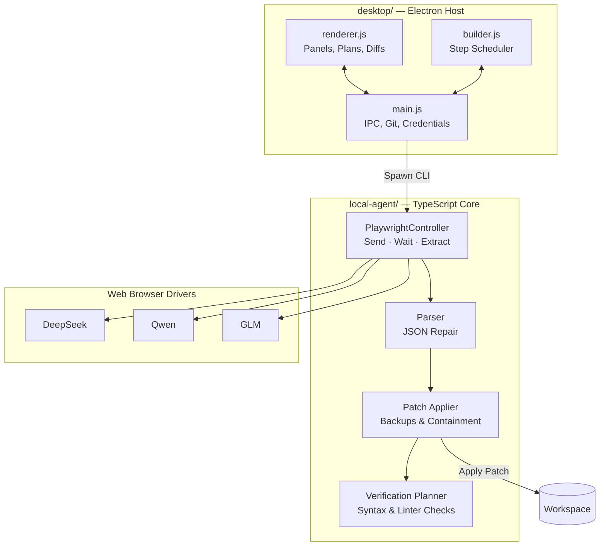

<div align="center">


# CloseNI

**Transform free web-based AI chats into an autonomous software engineering engine.**

`Electron` · `TypeScript` · `Playwright` · `No API Keys` · `Cross-Platform`

</div>

---

> CloseNI drives real browser sessions with models like DeepSeek, Qwen, and GLM, turning standard web chat interfaces into a local development backend. It crafts execution plans, writes code patches, runs multi-language syntax diagnostics, and heals build errors — without requiring API credentials.

---

### Key Capabilities

* **Zero-Credential Operations** — Playwright manages persistent browser profiles using existing web sign-ins.
* **Adaptive Planning** — Deconstructs high-level prompts into granular, dependency-mapped task graphs.
* **Concurrent Step Execution** — Runs independent task steps in parallel across isolated chat sessions.
* **Autonomous Error Recovery** — Captures compiler and linter outputs, feeding tracebacks back to the model to repair code.
* **Multi-Toolchain Diagnostics** — Native syntax verification for Rust (`cargo`), C/C++ (`make`/`gcc`/`g++`), Java (`mvn`/`gradle`), Python, and Node.js.
* **Portable Project Runner** — Generates `closeni.run.json` and standalone execution scripts (`run.sh` / `run.bat`).
* **Tailored Aesthetics** — Built-in visual themes, including high-contrast and retro CRT options.

---

### Pipeline Workflow

```
   YOU                CloseNI                  CHAT SITE               YOUR DISK
    │                    │                          │                      │
    │  "build me a       │                          │                      │
    │   flask todo api"  │                          │                      │
    ├───────────────────►│                          │                      │
    │                    │   plan this, as JSON     │                      │
    │                    ├─────────────────────────►│                      │
    │                    │◄─────────────────────────┤                      │
    │   ┌─────────────┐  │   6 steps, a run command │                      │
    │◄──┤ review plan │  │                          │                      │
    │   └─────────────┘  │                          │                      │
    │      approve       │                          │                      │
    ├───────────────────►│   step 1 …               │                      │
    │                    ├─────────────────────────►│                      │
    │                    │◄─────────────────────────┤                      │
    │                    │   {"files":[…]}          │                      │
    │                    ├──────────────────────────┼─────────────────────►│
    │                    │   apply, syntax check    │       files written  │
    │                    │                          │                      │
    │                    │   step 2 & 3 (parallel)  │                      │
    │                    ├═════════════════════════►│                      │
```

---

### System Architecture



---

### Getting Started

```bash
# Clone and install dependencies
git clone https://github.com/siddarth1872004/CloseNI.git
cd CloseNI
npm install
npm run build

# Download required Chromium binary
npx playwright install chromium

# Launch application host
cd desktop && npm start
```

#### Workflow Overview

1. **Workspace** — Select a target directory for your project.
2. **Settings** — Select an AI provider and authenticate your session.
3. **Chat** — Specify requirements or project goals.
4. **Build** — Inspect the generated graph and trigger automated assembly.
5. **Test** — Launch and verify the built application directly.

#### WSL Integration

```bash
source scripts/wsl-env.sh
```

---

### Language Diagnostics Matrix

| Environment | Project Manifest | File Diagnostic |
|---|---|---|
| **Rust** | `Cargo.toml` (`cargo check`) | `rustc --emit=metadata` |
| **C / C++** | `Makefile` (`make -n`) | `gcc -fsyntax-only` / `g++ -fsyntax-only` |
| **Java** | `pom.xml` / `build.gradle` | `javac` |
| **Python** | — | `python -m py_compile` |
| **JavaScript / TS** | — | `node --check` |

---

### Test Suites

```bash
# Unit suite
node local-agent/test/run-tests.cjs

# End-to-end browser integration suite
node local-agent/test/run-e2e.cjs
```

---

### Distribution Builds

```bash
# Unpacked distribution directory
npm run pack

# Target platform installer (.exe / .deb / AppImage)
npm run dist
```

---

### Directory Tree

```
desktop/          Electron UI host, IPC handlers, and renderer
local-agent/      Playwright drivers, DOM parsers, and patch application engine
shared/           Shared type definitions and schemas
build/            Brand assets and icons
docs/             Architecture specifications and implementation plans
scripts/          Environment configuration and helper scripts
```
