<div align="center">


# CloseNI

**Free web AI chats, turned into a software engineering engine.**<br>
It drives a chat site in a real browser, the way you would, and turns the conversation into a plan, files on your disk, compiler-checked code and repairs.

[](https://www.electronjs.org/)
[](https://www.typescriptlang.org/)
[](https://playwright.dev/)
[](https://nodejs.org/)
[](#what-it-is)
[](LICENSE)

[**Site**](https://siddarth1872004.github.io/CloseNI/) · [**How it works**](#how-it-works) · [**Architecture**](#architecture) · [**Browser layer**](#the-browser-native-layer) · [**Research**](#research) · [**Get started**](#getting-started) · [**Limitations**](#current-limitations)


</div>

---

## What it is

Every other coding agent bills per token through an API key. CloseNI does not have one.

It opens a real Chromium window and uses the session you are already signed into. It types the prompt into the page, waits for the answer to finish streaming, and reads it back out. From the model's side it is a person typing. From your side it is an agent that plans, writes files, compiles them, and repairs what it broke.

> **Where it stands, plainly.**
> - **DeepSeek** is driven end to end.
> - **Qwen Studio** and **GLM** are wired and listed as **coming soon**.
> - **Ollama** is local and **chat-only**.
> - Nothing is published yet. Build it from source.
>
> The [limitations](#current-limitations) are listed as carefully as the features.

<div align="center">


</div>

### Contents

| | | |
|---|---|---|
| [How it works](#how-it-works) | [Twelve languages](#twelve-languages) | [Safety model](#safety-model) |
| [Architecture](#architecture) | [The browser-native layer](#the-browser-native-layer) | [Nine themes](#nine-themes) |
| [Providers](#providers) | [Research](#research) | [Tests and verification](#tests-and-verification) |
| [Anatomy of a build](#anatomy-of-a-build) | [The interface](#the-interface) | [Getting started](#getting-started) |
| [Build, check, repair](#build-check-repair) | [One conversation](#one-conversation) | [Directory tree](#directory-tree) |
| [The run file](#the-run-file) | [Distribution builds](#distribution-builds) | [Current limitations](#current-limitations) |

Also: [CHANGELOG](CHANGELOG.md) · [Release process](docs/RELEASING.md) · [Roadmap](docs/ROADMAP.md) · [Browser layer design](docs/architecture/browser-research.md) · [Browser test report](docs/testing/browser-test-report.md)

---

## How it works

<div align="center">


</div>

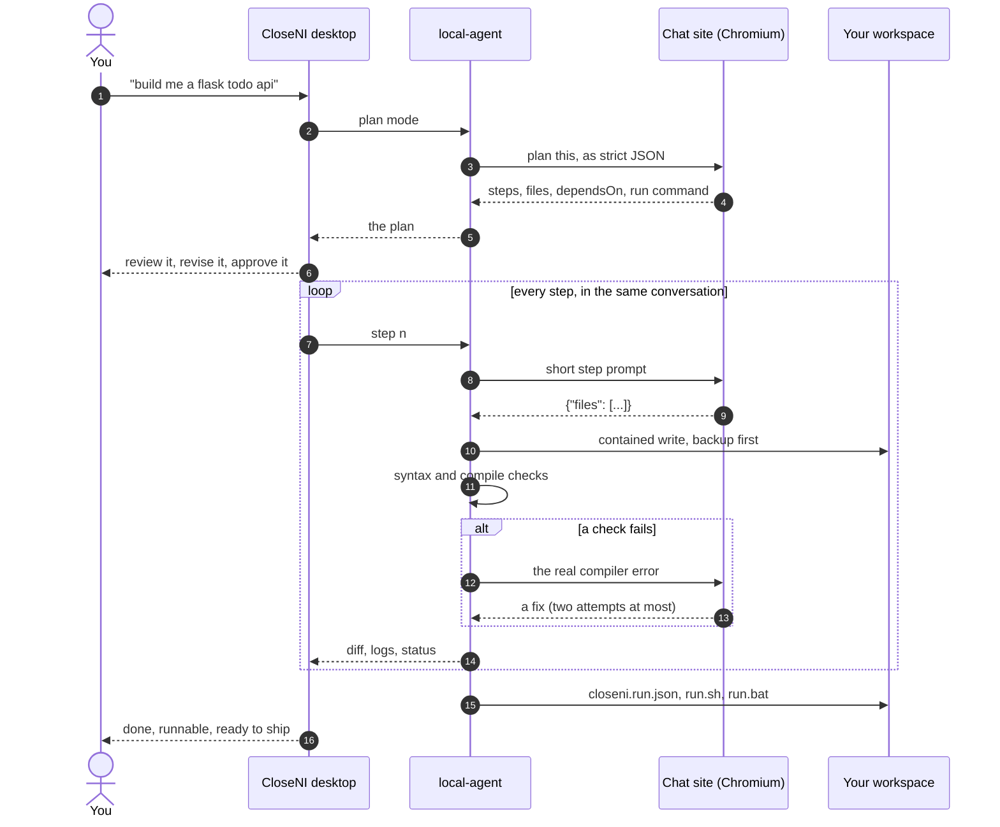

Nothing is written before you approve the plan, and every step reports what it touched before the next one begins.

---

## Architecture

<div align="center">


</div>

<details>
<summary><b>The same thing, as a Mermaid diagram</b></summary>

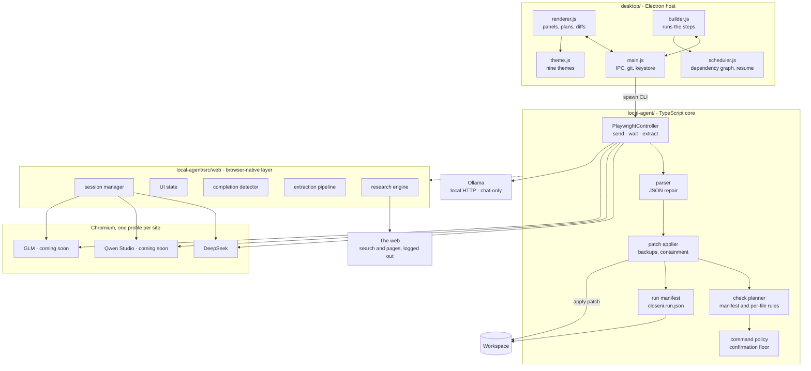

</details>

There is no bundler. Renderer modules are written UMD-style: they attach to `window` in the browser and export under Node. That makes scheduling, theming, diffing and entry-point detection unit-testable without a build step or a headless Electron instance.

The TypeScript core compiles to CommonJS in `local-agent/dist/`, and tests run against the compiled output rather than the source, so what is tested is what ships.

---

## Providers

CloseNI drives a chat site the way a person does, so each site needs its own page control. Where each one stands:

| Provider | Status | What is known |
|---|---|---|
| **DeepSeek Chat** |  | Driven end to end: plan, build, repair, verify. Its reply stream (`/api/v0/chat/completion`) is measured and used to know when an answer ended. |
| **Qwen Studio** |  | Page control works against the live site: the input is found, long prompts are pasted via the clipboard, and send and completion detection are both confirmed. It is gated because a build-sized prompt (~9k characters) outruns the 120 s completion wait while the model is still thinking. |
| **GLM (Z.ai)** |  | The live site declines the build prompts, and the model and thinking controls were not found on the page. Selectors have never been confirmed. |
| **Ollama (local)** |  | The first provider that is not a web page: no selectors, no login, no rate limit. Chat works. Plan and build still need a browser provider, and it says so if you try. |
| HuggingChat, Open WebUI | not implemented | Config stubs only, `enabled: false`, no selectors. |

Gated providers appear in Settings, so it is clear they are planned rather than missing, but they cannot be selected. `getUsableProvider` refuses them in the agent too, so a preference saved before the gate cannot start a session on one.

Each provider is a JSON file in [`local-agent/config/providers/`](local-agent/config/providers/), read at runtime. Fixing a selector is a text edit and a re-run, not a rebuild. Each gated file carries a `_comingSoonReason` saying what is left, and a test enforces that the reason is there.

---

## Anatomy of a build

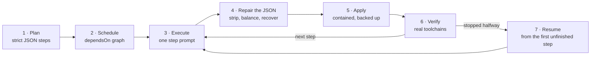

<details open>
<summary><b>Each stage, in detail</b></summary>

1. **Plan.** The prompt is wrapped with instructions demanding strict JSON: an array of steps, each with a title, a description, the files it will touch, and a `dependsOn` list. The step count comes from the described scope, so a single-file script is not padded to seven steps and a full-stack application is not squeezed into seven. The plan also carries a `run` command for the finished project.
2. **Schedule.** The `dependsOn` edges form a directed graph. A step runs once everything it depends on has succeeded. A failure blocks only the steps that depend on it. Duration is estimated at roughly ninety seconds per step and shown before you commit.
3. **Execute.** Each step goes out as a short instruction in the same conversation, carrying the current state of the files it declares. The reply is expected as JSON with a `files` array: path, full contents, and an action.
4. **Repair the JSON, not just the code.** Web chats wrap answers in prose and fenced blocks, truncate long messages, and sometimes emit trailing commas. The parser strips the wrapper, balances braces, and recovers a usable object from a partial one before it gives up.
5. **Apply.** Every write is contained to the workspace root: a path that escapes it is refused, not sanitised. Existing files are backed up before they are overwritten.
6. **Verify.** The changed files decide which checks run. See [twelve languages](#twelve-languages).
7. **Resume, do not restart.** Completed steps are recorded. If a build stops halfway, starting again picks up at the first unfinished step. That covers a failure, a closed window, or a machine that went to sleep. The log says so plainly: `resuming: 3/7 already done`.

</details>

---

## Build, check, repair

<div align="center">


</div>

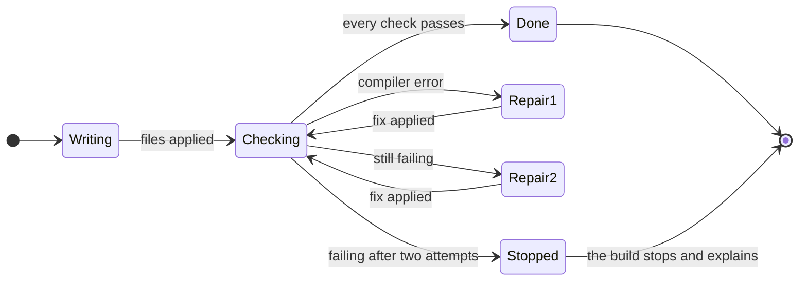

A failing check does not fail the build. The compiler's own stderr (the file, the line, the message) goes back with the step, so the model repairs the specific defect instead of rewriting from memory. **Two attempts**, then the step is marked failed and the build stops with an explanation, instead of grinding forward on broken code.

Environment failures are treated differently from code failures. Suppose `python3 -m venv` dies because the system Python is externally managed. That is a problem with the machine, not the generated source. It is reported without spending the step's repair budget on code that was never wrong.

---

## Twelve languages

A manifest claims its language. If the workspace has a `Cargo.toml`, Rust files are checked once with `cargo check` rather than one file at a time, because a file that imports its sibling cannot be validated alone. Where no manifest exists, each changed file is checked individually.

<div align="center">


</div>

| Language | Project check (manifest present) | Per-file check |
|---|---|---|
| **Rust** | `Cargo.toml` → `cargo check` | `rustc --emit=metadata` |
| **Go** | `go.mod` → `go build ./...` | `gofmt -e` |
| **TypeScript** | `tsconfig.json` → `tsc --noEmit` | `tsc` |
| **Java** | `pom.xml` → `mvn -q compile`<br>`build.gradle[.kts]` → `gradle compileJava -q` | `javac` |
| **C#** | `*.csproj` → `dotnet build` | — |
| **C** | `Makefile` → `make -n` | `gcc -fsyntax-only` |
| **C++** | `Makefile` → `make -n` | `g++ -fsyntax-only` |
| **Python** | — | `python -m py_compile` |
| **JavaScript** | — | `node --check` |
| **Ruby** | — | `ruby -c` |
| **PHP** | — | `php -l` |
| **Shell** | — | `bash -n` |

`make -n` is a dry run on purpose. It proves the Makefile parses and its targets resolve, without dropping object files into your workspace. A check should not build.

A manifest claims its extensions whether or not the tool is installed. So a Rust project on a machine without `cargo` reports a missing toolchain, instead of silently falling through to a weaker per-file check.

---

## The browser-native layer

`local-agent/src/web/` treats DeepSeek, Qwen and GLM as **web applications driven through a browser**, not as APIs. It is built beside the controller that runs builds today and does not replace it. It can take over a provider once it has passed live on that provider.

<div align="center">


</div>

The old question was "did a composer appear within 15 seconds?" Every failure answered it the same way: "not signed in". The new layer names the state instead. The possible states are:

`LOADING` · `READY` · `CHAT_READY` · `GENERATING` · `GENERATION_COMPLETE` · `GENERATION_FAILED` · `AUTH_REQUIRED` · `CAPTCHA` · `RATE_LIMITED` · `ERROR` · `UNKNOWN`

**The rules it keeps, whatever the site does:**

- **No evasion.** It never signs in, never creates an account, and never tries to get past a login, a challenge or a rate limit. Detection exists so the run can **stop and say why**, with a screenshot, a sanitised DOM and an ARIA snapshot saved for you.
- **No leaks.** Passwords, cookies, tokens and credentials are redacted before anything is logged. Authenticated content is never cached.
- **No guesses.** Every selector carries its provenance: `MEASURED` on the live site, `UNVERIFIED`, or `FIXTURE`. Behaviour nobody has observed is marked `UNKNOWN`.

<details>
<summary><b>How it knows a reply has finished, without fixed sleeps</b></summary>

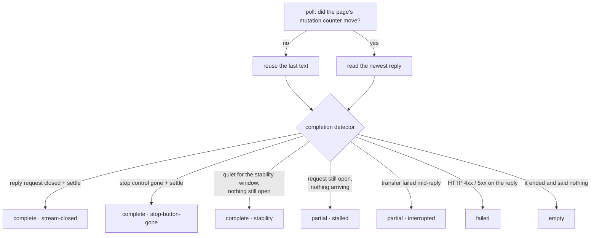

A mid-answer pause is not a finished answer. While the stop control is up, or the reply request is still open, stability alone never ends the wait.

</details>

<details>
<summary><b>How a reply becomes structured data</b></summary>

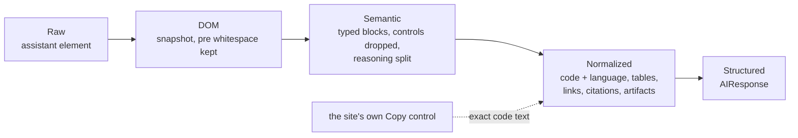

`AIResponse` fields are filled only from what was observed. The conversation id comes from the URL, the message id from markup, and reasoning only when a reasoning block exists. A reply that said nothing is `empty`, never the previous answer.

</details>

**Tested, but not yet live.**

- It has been tested in real Chromium against local pages shaped like each provider: DeepSeek streams over XHR with no stop control, Qwen has a stop control, and GLM has a contenteditable composer and obfuscated class names.
- Every provider runs the same scenarios: login walls, challenges, 429s, modals, popups, dialogs, pauses, stalls, cut connections, redesigns, crashes and a locked main thread.
- It has **not met a live site yet**. The development machine's network refused every provider host, so the live column of the [provider matrix](docs/testing/provider-matrix.md) reads `BLOCKED`.
- To produce the first real row, run `npm run webtest -- deepseek --headed` on a signed-in machine.

---

## Research

The **Research panel** runs two halves together and reports them separately:

- **The web half** turns on the provider's own web search (DeepSeek's Smart Search toggle, forced on for that run only), asks the question, and lists the sources it cited.
- **The GitHub half** searches repositories through the token you are signed in with. That raises the rate limit from ten searches a minute to thirty. Any result can be cloned, or used as a reference: its README and file list go into the next plan's context.

It runs in a conversation of its own, so it never disturbs the one your build is using.

Beside it, in `local-agent/src/web/research/`, is a research engine that does the whole job itself. It plans, searches, reads, extracts evidence, cross-checks sources and cites every line:

<div align="center">


</div>

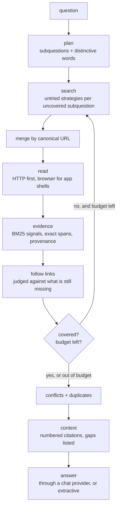

Relevance is a set of named signals, not a single made-up "quality score". A syndicated mirror is detected and not counted as a second source. When two sources disagree on a number in the same unit, both are kept and the conflict is listed. The engine is fixture-tested: on the fixture web it stops as `sufficient`, finds both planted contradictions, and reaches a page no search returned by following a link. It is not yet wired into the panel, and its live search-engine adapters are `UNVERIFIED`.

---

## The interface

Six panels, numbered in the order you normally move through them.

<table>
<tr>
<td width="50%" valign="top">

**01 · Chat.** Describe it, then read the plan.

The prompt goes in, and a structured plan comes back: numbered steps, the files each one owns, the dependencies between them, and the command that will run the project. Nothing has been written to disk yet. Send it back for revision as many times as you like.

</td>
<td width="50%"></td>
</tr>
<tr>
<td width="50%"></td>
<td width="50%" valign="top">

**02 · Builder.** Watch it happen, step by step.

Live step status, and the exact diff for the running step. **Suggest a change to this step** steers a single step without restarting. Two logs: **Agent** is the story (`step 4/7: API routes`), and **Project** is the evidence (`CHECK_RESULT: PASS`).

</td>
</tr>
<tr>
<td width="50%" valign="top">

**03 · Test.** Run it, and ask about it.

The run command arrives resolved, with a badge saying where it came from: `SAVED`, `FROM YOUR PLAN`, `DETECTED` or `NOT FOUND`. **Run tests** runs the project's own suite and smoke-starts its entry point. A missing runner is reported as **not run**, never as a pass.

</td>
<td width="50%"></td>
</tr>
<tr>
<td width="50%"></td>
<td width="50%" valign="top">

**05 · Ship.** Commit, push, and watch CI.

`git init`, status, commit-all and push, plus a live list of GitHub Actions runs and a button to dispatch a workflow. The token is encrypted at rest and never written into the repository.

</td>
</tr>
<tr>
<td width="50%" valign="top">

**04 · Research** is [above](#research). **06 · Settings** covers four areas:

- the provider, the Chromium install and sign-in
- autonomy (*ask each command*, *auto-allow*, *never run commands*)
- appearance
- about

The sign-in is a real browser window: you log in the way you always do, and the profile persists.

</td>
<td width="50%"></td>
</tr>
</table>

---

## One conversation

Chat, planning and building all continue **the same conversation** on the provider's site. It is the one you can open in your own browser from the sidebar.

```
one profile, one login, one thread
│
├── "build me a flask todo api"        ← chat
├── the plan, as JSON                  ← planning, in the same thread
├── step 1 …  step 2 …  step 3 …       ← the build, still the same thread
└── "why did this fail?"               ← Test and Suggest, same thread again
```

In a separate thread, a step prompt has to explain the whole project again; in the shared one it can be a short instruction. When a build had a thread of its own, step 1 of a fifteen-step build reached **9853 characters** and spent its whole completion wait being read rather than answered. In the shared conversation the model already has the plan. The reply format is stated once, which alone saves **2801 characters on every step after the first**.

**The trade-off, stated plainly.** A conversation has one composer, so steps go one at a time. Independent work used to fan out across separate tabs, and that is exactly what forced the oversized prompts. The reversal is recorded, with its reasoning, in [docs/ROADMAP.md](docs/ROADMAP.md#4--concurrency--multi-agent--built-then-deliberately-reversed).

**New Chat** starts over: it clears the saved thread, and the next chat, plan or build opens a fresh one.

---

## The run file

Guessing an entry point from filenames breaks the moment a project lives at `src/app/server.py`. So the answer is written down, in a file the project keeps.

```jsonc
// closeni.run.json
{
  "version": 1,
  "run": "python3 src/app/server.py",
  "install": "pip install -r requirements.txt",
  "language": "python",
  "userEdited": false,
  "generatedBy": "CloseNI 1.0.0"
}
```

Alongside it sit `run.sh` and `run.bat`, so the project starts from a terminal, a file manager or another machine, with CloseNI nowhere in the picture. Resolution order is `manifest` → `plan` → `detected` → none. Once `userEdited` is set, later builds leave the command alone.

---

## Safety model

An agent that writes files and runs commands on your machine has to be explicit about what it will not do.

| | |
|---|---|
| **Commands always require confirmation** | `sudo` · `su` · package managers · `rm -rf` · `dd if=` · `mkfs` · `chmod 777` · `chown` · `shutdown` / `reboot` · `curl … \| sh` and friends · writes to raw disks · `git push --force` without `--with-lease`. The test covers the whole command string, because a real reply once hid `sudo apt install` behind `apt install … \|\| sudo apt install …`. |
| **Environment setup is recognised** | `venv`, `pip install` and `poetry install` are classified, so a failure there is an environment problem, not broken code. |
| **File writes are contained** | A path that escapes the workspace root is refused. Overwrites are backed up first. |
| **Git never goes through a shell** | Arguments are passed as an array with `shell: false`. A commit message of `test; echo INJECTED` becomes a commit subject containing that text, and nothing executes. |
| **Tokens stay sealed** | The GitHub token is encrypted with the OS keystore, handed to git through `GIT_ASKPASS`, and redacted from every log line by exact-string replacement. It never reaches `.git/config`, an argument list, a plaintext file, the renderer or the agent. |
| **Session data is never committed** | Browser profiles, cookies, chat URLs and browser-layer diagnostics live under `local-agent/storage/`. They are excluded from version control and from the packaged app, whose file list is an explicit allow-list. |
| **The browser layer never gets past a gate** | A login, a challenge or a rate limit stops the run and is recorded. See [the browser-native layer](#the-browser-native-layer). |

---

## Nine themes

Nine built-in themes, switchable from Settings. Themes style CloseNI's own chrome and never touch a project built with it.

<div align="center">


</div>

| Theme | Character | Theme | Character |
|---|---|---|---|
| **Midnight** | The default. Near-black, low chroma. | **Cassette · Miami** | Sunset gradient, high saturation. |
| **Paper** | Full light mode, not a dark theme with the lights up. | **Cassette · Grid** | Flat retro, no texture. |
| **Phosphor** | Green CRT, with scanlines. | **Blueprint** | Drafting blue on a grid. |
| **Amber** | Amber CRT, with scanlines. | **High contrast** | Maximum legibility, no decoration. |
| **Cassette · Indigo** | Retro-futurist indigo and magenta. | | |

<table>
<tr>
<td width="33%"><br><div align="center"><sub><b>Paper</b></sub></div></td>
<td width="33%"><br><div align="center"><sub><b>Phosphor</b></sub></div></td>
<td width="33%"><br><div align="center"><sub><b>Cassette</b></sub></div></td>
</tr>
</table>

Two lints keep this honest, as tests rather than conventions:

- One rejects any colour literal outside a theme block.
- The other requires every theme to redefine the whole palette.

Pixel-art motion appears throughout the app, driven by `steps()` timing so the animation lands on discrete frames. Every animation in this README follows the same rule: it is generated by [`scripts/make-svg-assets.mjs`](scripts/make-svg-assets.mjs), stays on the pixel grid, and moves in discrete steps.

---

## Tests and verification

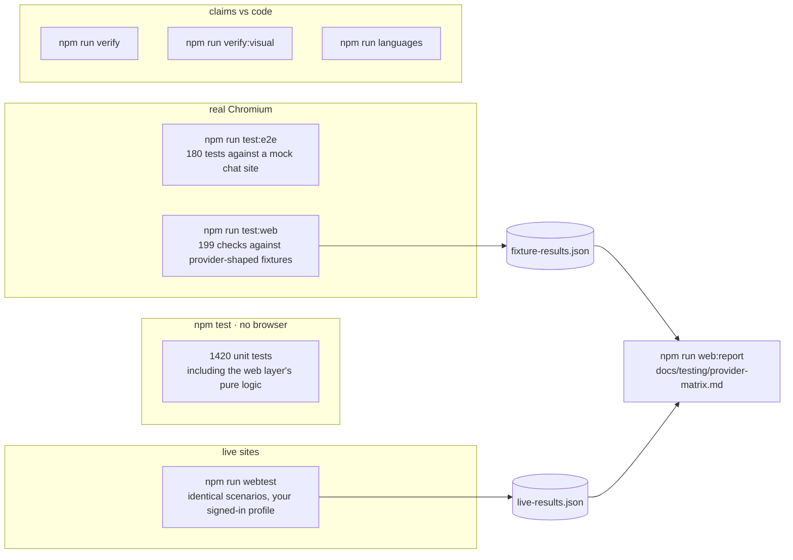

```bash
npm test                  # unit suite: no browser required
npm run test:e2e          # end-to-end: real Chromium against a local mock provider
npm run test:web          # the browser layer: every group below, writes fixture-results.json
npm run test:browser      #   session manager, lifecycle, navigation, selector chains, diagnostics
npm run test:providers    #   identical scenarios for deepseek, qwen and glm (or test:deepseek / :qwen / :glm)
npm run test:extraction   #   normalisation units + recorded DeepSeek markup
npm run test:research     #   fetcher, search, loop, dedupe, conflicts, links, budgets
npm run test:chaos        #   killed browser, closed tab, removed selector, viewport, reload, malformed DOM
npm run webtest -- all    # the same scenarios against the live sites (never signs in)
npm run web:report        # regenerate the provider matrix from recorded results
npm run verify            # structural checks: claims vs code, assets, release config, packaging
npm run verify:visual     # all nine themes rendered and contrast-checked, plus the site
npm run languages         # every language check against the real compiler, good and broken code
```

- **End-to-end.** The end-to-end suite drives a real Chromium against a local HTTP server that imitates a chat site. Only the model's answers are faked. The page interaction, streaming detection, extraction, parsing, patch application and verification are all the production paths.
- **Browser suite.** The browser suite found seven real defects that reading the code had not, including a stream binding that reported to the wrong object and a login that appeared after send and was read as "sent". They are listed in the [test report](docs/testing/browser-test-report.md).
- **`scripts/verify.mjs`.** [`scripts/verify.mjs`](scripts/verify.mjs) checks the things that rot silently:
  - the documentation still matches the code;
  - every image and anchor in this file resolves;
  - no SVG carries a script or an external reference;
  - the packaged artifact contains nothing from `local-agent/storage/`.
- **`verify-visual.mjs`.** [`scripts/verify-visual.mjs`](scripts/verify-visual.mjs) renders the app under each of the nine themes and measures the real contrast of every element that carries meaning.

Each verification script prints, at the end, what it does **not** cover.

---

## Getting started

#### From source

```bash
git clone https://github.com/siddarth1872004/CloseNI.git
cd CloseNI
npm install
npm run build

# the browser CloseNI drives
npx playwright install chromium

# launch
cd desktop && npm start
```

**Requirements:**

- Node.js 18 or newer.
- Around 650 MB of disk for the Playwright Chromium download.
- Windows 10+, or a Linux desktop with a keyring available for encrypted token storage.

#### Downloads

**There are none yet.** Installers have been built and withdrawn while known problems are worked through, and plans do not always parse. Shipping a binary that fails on the first thing you try is worse than shipping nothing, so the releases page is deliberately empty.

#### First run

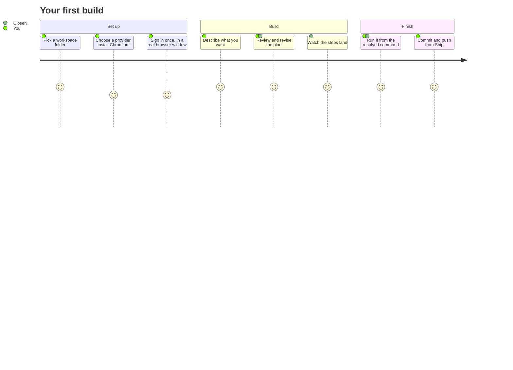

A **Getting started** checklist above the chat walks through these steps in order, with one button for whichever step you are on. It ticks each one off from what the app can actually see, and disappears once you have sent a first message.

#### WSL

```bash
source scripts/wsl-env.sh
```

This sets up the display and library paths Electron and Chromium need under WSL2.

---

## Distribution builds

Releases are driven by a tag. `npm version 1.0.1 -m "Release %s"` followed by `git push --tags` builds on `windows-latest` and `ubuntu-latest`, and attaches the installers to a draft release. The full process, including how to verify an artifact before publishing, is in [docs/RELEASING.md](docs/RELEASING.md).

| Platform | Artifact |
|---|---|
| Windows | `CloseNI-Setup-<version>.exe` (NSIS, chooses its own install directory) |
| Linux | `CloseNI-<version>.AppImage` |
| Linux | `closeni_<version>_amd64.deb` |

```bash
npm run pack   # unpacked distribution directory
npm run dist   # platform installer (.exe / .deb / AppImage)
```

The packaged `files` list is an explicit allow-list. Widening it to a glob would sweep `local-agent/storage/` (live session cookies and private chat URLs) into a shipped artifact.

---

## Directory tree

```
desktop/            Electron UI host, IPC handlers, and renderer
  main.js             process host: IPC, git, credentials, agent lifecycle
  renderer.js         panels, plan review, diff rendering
  builder.js          step orchestration
  scheduler.js        dependency graph, runnable set, resume state
  theme.js            theme registry and persistence
  github-safe.js      token redaction, argument validation, URL parsing
  entrypoint.js       entry-point detection across languages

local-agent/        the TypeScript core
  src/providers/      PlaywrightController, per-provider page control, the shared stream tap
  src/verification/   check planning and command policy
  src/web/            the browser-native layer
    browser/            session manager, navigation, diagnostics
    selectors/          fallback chains with diagnosis
    semantic/           DOM snapshot, tolerant HTML parser, typed blocks
    response/           Raw → DOM → Semantic → Normalized → Structured
    providers/          AIWebProvider, UI state, completion, DeepSeek / Qwen / GLM adapters
    research/           planner, search, fetcher, page model, evidence, conflicts, context, agent
  config/providers/   one JSON file per provider, read at runtime
  test/               unit, end-to-end and browser suites, plus the fixture web

vscode-extension/   a 97-line VS Code prototype that runs the agent against the open
                    workspace. It compiles and is kept, but it predates the desktop app
                    and is not the supported interface.

shared/             shared type definitions and schemas
build/              brand assets and icons
docs/               architecture, audit, testing results, plans, screenshots, the site
scripts/            verification, asset generation, release and environment helpers
```

---

<div align="center">


</div>

## Current limitations

Stated plainly, because a README that only lists strengths is not useful.

- **One provider is ready.** DeepSeek is driven end to end. Qwen Studio and GLM ship gated as coming soon. See [providers](#providers).
- **The browser-native layer has never met a live site.** It passes every fixture scenario, but every live row so far is `BLOCKED` by the development machine's network, and builds still use the older controller.
- **Chat sites change.** Provider control is per-site page automation. A redesign can break extraction until the selectors are updated, which is a JSON edit, not a code change.
- **Verification is syntax and compilation, not correctness.** A project can pass every check and still be wrong.
- **Nothing is published.** Installers build in CI and have been withdrawn.
- **Plans do not always parse.** The reply is re-asked once and reported honestly if that fails, but it remains a live limitation.
- **Installers are unsigned.** SmartScreen and Gatekeeper will say so, and that warning is accurate.
- **Only the Linux artifacts have been verified.** The first `.exe` the release workflow produces is unverified until someone installs it.
- **Large projects are not proven at scale.** Builds of a few dozen steps behave well. Beyond that is untested.
- **Terms of service are your responsibility.** Automating a web interface may conflict with a provider's terms. Check before pointing this at an account you care about.

---

## License

MIT. See [LICENSE](LICENSE). Copyright (c) 2026 Siddarth S.

<div align="center">
<sub>Every animation above is pixel art generated by a script. No GIFs and no JavaScript, and every one of them loops forever.</sub>
</div>
