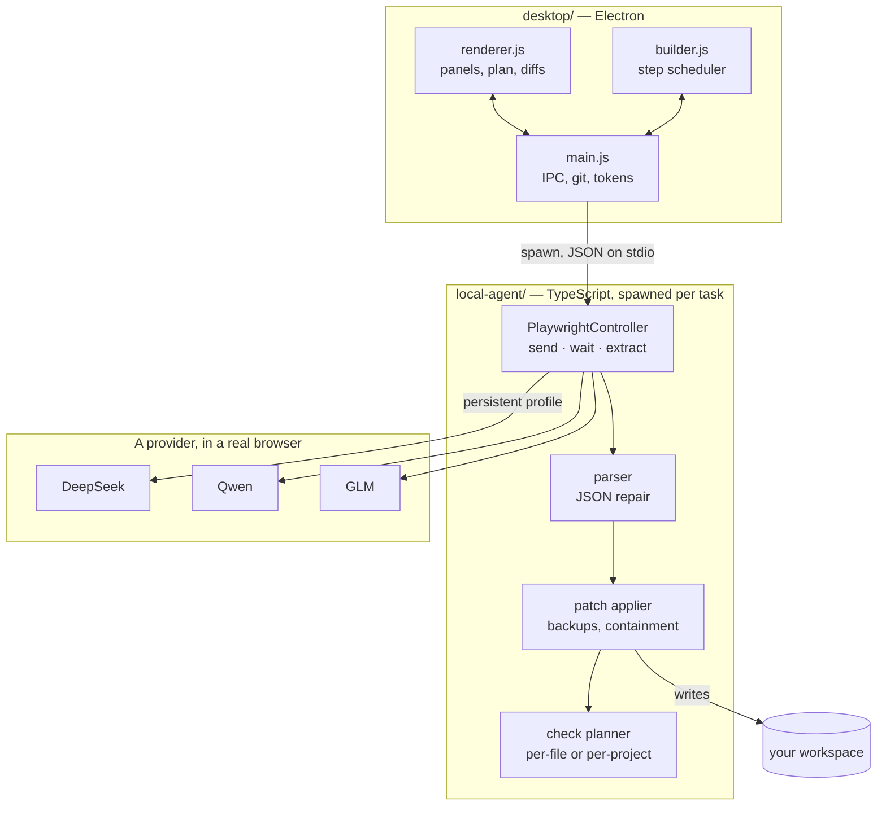

<div align="center">


# CloseNI

**A desktop agent that drives the AI chat sites you already pay nothing for,
and turns them into a build pipeline.**

`Electron` · `TypeScript` · `Playwright` · `no API keys` · `no bundler`

</div>

---

## What it is

Every coding agent needs an API key. CloseNI doesn't. It opens a real browser,
signs into DeepSeek, Qwen or GLM the way you would, and then **drives that chat
window as if it were an API** — sending prompts, reading replies out of the DOM,
parsing them into file changes, applying them to your workspace, and syntax
checking the result.

You describe an idea in plain language. It produces a plan, builds it step by
step, verifies each step, and hands you a project that knows how to run itself.

```
   YOU                CloseNI                  A CHAT SITE              YOUR DISK
    │                    │                          │                       │
    │  "build me a       │                          │                       │
    │   flask todo api"  │                          │                       │
    ├───────────────────►│                          │                       │
    │                    │   plan this, as JSON     │                       │
    │                    ├─────────────────────────►│                       │
    │                    │◄─────────────────────────┤                       │
    │   ┌─────────────┐  │   6 steps, a run command │                       │
    │◄──┤ review plan │  │                          │                       │
    │   └─────────────┘  │                          │                       │
    │      approve       │                          │                       │
    ├───────────────────►│   step 1 …               │                       │
    │                    ├─────────────────────────►│                       │
    │                    │◄─────────────────────────┤                       │
    │                    │   {"files":[…]}          │                       │
    │                    ├──────────────────────────┼──────────────────────►│
    │                    │   apply, syntax check    │        files written  │
    │                    │                          │                       │
    │                    │   step 2 and 3 …         │                       │
    │                    ├═════════════════════════►│   (in parallel)       │
```

---

## Highlights

| | |
|---|---|
| **No API key, ever** | Playwright drives a real signed-in browser session. Your provider account is the only credential. |
| **Plans as long as the work** | The model decides how many steps a project needs — 2 for a script, 20+ for an application. |
| **Parallel steps** | Independent steps run at the same time in separate tabs. Conversations parallelise; file writes never do. |
| **Self-healing builds** | A failed syntax check goes back to the model with the error, up to a retry budget. |
| **Nine languages, two ways** | A manifest at the root means one project-level check; no manifest means per-file. Rust, C, C++, Java, Python, JS. |
| **Projects that run themselves** | Every build writes `closeni.run.json` plus `run.sh` / `run.bat`. Reopen it next month and Test already knows the command. |
| **Ask about a failure** | The Test chat carries the last command and its output automatically. You never paste a traceback. |
| **Nine themes** | Including three retro-futurist CRT variants and a high-contrast fallback. |
| **Ships as an installer** | electron-builder produces `.exe`, AppImage and `.deb` on a tag. |

---

## Architecture

Two processes, one contract. The desktop app never touches a browser; the agent
never touches a window.



**The seam is deliberate.** The agent is a CLI you can run by hand
(`node local-agent/dist/index.js plan "…" /path deepseek`), which is exactly how
the end-to-end suite drives it — against a mock chat server, with only the
model's answers faked.

---

## Quickstart

```bash
npm install
npm run build                  # shared/ then local-agent/
npx playwright install chromium
cd desktop && npm start
```

Then, in the app:

```
  1  Browse            pick an empty folder
  2  Settings          choose a provider, press Sign in, log in as yourself
  3  Chat              describe what you want built
  4  Generate Plan     review the steps and the estimated duration
  5  Build with this   watch it write, check, and heal
  6  Test              press Run — the command is already there
```

### On WSL

```bash
source scripts/wsl-env.sh      # then the commands above work as written
```

WSL needs three things the script handles: a Linux Node ahead of the Windows one
on `PATH` (a Windows Node cannot run from a `\\wsl.localhost\...` path), the
Chromium and Electron system libraries, and `ELECTRON_RUN_AS_NODE` unset.

---

## How a build step actually runs

```
                    ┌──────────────────────────────────────────┐
                    │  context: tree + relevant files, DELTA    │
                    │  only — the thread already saw the rest   │
                    └────────────────────┬─────────────────────┘
                                         ▼
   send prompt ──► wait for reply ──► parse ──► repair JSON if needed
                        │                            │
                        │ stop button vanished,      │ no files parsed?
                        │ or text stable 4 ticks     │ re-ask once, strictly
                        ▼                            ▼
                   ┌─────────────────────────────────────────┐
                   │      everything below is SERIALISED     │
                   │      even when steps run in parallel    │
                   ├─────────────────────────────────────────┤
                   │  apply patch  ──►  backup overwritten   │
                   │  update ledger ──► what the thread saw  │
                   │  syntax check  ──► gcc / rustc / py …   │
                   │  suggested commands ──► your approval   │
                   └────────────────────┬────────────────────┘
                                        ▼
                              pass? ──► done
                              fail? ──► send the error back, retry
```

**Why serialised.** Two steps can talk to two chat tabs at once, but only one
may write. Otherwise they interleave writes to the delta ledger, race on the
same backup directory, and — worst — both raise a permission prompt, when
approval replies arrive on a single queue with nothing saying which command
they answer.

---

## Parallel steps

A plan declares which steps depend on which, so independent ones run together.

```
   serial (a plan with no graph)        with a declared graph, limit 2

   1 ──► 2 ──► 3 ──► 4                  1 ──┬──► 2 ──┐
                                            └──► 3 ──┴──► 4
   ~6 min                                ~4 min
```

Set the limit in **Settings → Permissions**. Default 2.

> More is not always better. Each parallel step is another conversation with
> your provider, and providers rate-limit. If builds start hanging, lower it.

---

## The run file

Every project CloseNI builds gets:

```
closeni.run.json     what the app reads
run.sh / run.bat     so the project runs without CloseNI
```

```json
{
  "version": 1,
  "run": "python3 src/app/server.py",
  "install": "pip install -r requirements.txt",
  "userEdited": false
}
```

Written from the command the model declared while planning. **An edited command
is never overwritten** — correcting it and having the next build undo you is how
people stop trusting a tool.

The Test panel says where the answer came from:

```
  SAVED             from closeni.run.json
  FROM YOUR PLAN    the model declared it while planning
  DETECTED          guessed from the files present
  NOT FOUND         nothing to go on — type one
```

---

## Language support

| Manifest at the root | Check | Claims |
|---|---|---|
| `Cargo.toml` | `cargo check` | all `.rs` |
| `Makefile` | `make -n` | `.c` `.cpp` `.h` `.hpp` |
| `pom.xml` | `mvn -q compile` | all `.java` |
| `build.gradle` | `gradle compileJava -q` | all `.java` |

No manifest means per-file: `gcc -fsyntax-only`, `g++ -fsyntax-only`,
`rustc --emit=metadata`, `javac`, `py_compile`, `node --check`.

Rust and Java cannot be checked file by file — a `.rs` containing `mod utils;`
fails alone even when the crate is perfect, and the model would then burn its
retries "fixing" code that was never broken. A missing toolchain skips the check
rather than failing it.

---

## GitHub

**Ship → GitHub.** Create a token with `repo` and `workflow` scopes — the button
opens GitHub's page with those pre-selected — and paste it once.

Where the token goes, and where it never does:

```
  stored    encrypted with your OS key (Keychain / DPAPI / libsecret)
            no secure storage available?  memory only, never plaintext

  used      GIT_ASKPASS helper, reading it from its own environment

  NEVER     .git/config          (it would persist in your project)
            process arguments    (ps would show it)
            any log line         (redacted on every path)
            the renderer         (no getter exists)
            the agent process    (it drives browsers; it has no business with it)
```

Search results in **Research** gain two actions. **Use as reference** feeds a
repository's README and file layout into your next plan without touching your
workspace. **Clone** copies it in, after showing you its licence.

---

## Providers

The picker lists every enabled config in `local-agent/config/providers/`. Adding
a provider is a JSON file — no code change, no markup change.

| Provider | Controls it exposes | How its state is read |
|---|---|---|
| **DeepSeek** | Mode, Deep thinking, Smart Search | `aria-pressed` / `aria-checked`, inline |
| **Qwen Studio** | Model, Thinking level | the trigger's visible text |
| **GLM (Z.ai)** | Model, Deep Think level | `data-selected` on Radix menu items |

Three UI stacks, three ways of reading state — which is why each provider gets
its own control module rather than a shared schema that would have forced them
into one shape.

Completion is detected two ways: the provider's own stop button vanishing
(exact, immediate) or the reply text sitting still for four polls (the fallback).
A wrong `stopButton` selector costs speed, not correctness.

> `GLM (Z.ai)` ships with **unverified chat selectors** — never checked against
> the live site. If it hangs or sends nothing, correct `chatInput` and
> `sendButton` in `glm.json` first; it is a text edit, not a code change.

---

## Tests

```bash
npm run build
node local-agent/test/run-tests.cjs     # unit
node local-agent/test/run-e2e.cjs       # end to end, ~15 min
```

```
   unit   470   parsing · JSON repair · patching · context ranking · delta
                storage paths · check planning · themes · scheduler · redaction
                git argument safety · repo URL parsing · API call shapes

   e2e    155   the real CLI against a mock chat server. Playwright drives a
                real browser; only the model's answers are faked.
```

The end-to-end suite covers plan, revise, build, chat, testall, the re-ask path,
the self-heal loop, command approval and denial, oversized-argument spilling,
headed mode, thread persistence, delta context, build sessions, provider
controls, and a full plan → multi-step build → run.

Both suites skip browser sections cleanly when Chromium is unavailable. Point
the agent at different provider configs with `AGENT_PROVIDER_DIR`.

---

## Building installers

```bash
npm run pack       # unpacked directory, current platform
npm run dist       # a real installer, current platform

git tag v1.0.0 && git push --tags
```

The tag triggers GitHub Actions: Windows builds the NSIS `.exe`, Ubuntu builds
the AppImage and `.deb`, and all three attach to a Release.

**First launch downloads Chromium** — about 389MB, once, kept in your user data
directory. Bundling it would put half a gigabyte in every release.

**Builds are unsigned.** SmartScreen will warn; code signing needs a paid
certificate.

---

## Where your data lives

```
  <userData>/                     %APPDATA%/CloseNI  ·  ~/.config/CloseNI
    sessions.json                 chat threads per workspace
    browser-profiles/<provider>/  your signed-in session — treat as a password
    browsers/                     Chromium, downloaded on first run
    github.token                  encrypted, or absent
    skills/ · personas/           your reusable instructions
```

Never beside the application: a packaged app cannot write to its own install
directory, and on Windows that would be `Program Files`.

---

## Notes and known traps

- **Provider profiles are credentials.** `browser-profiles/` holds live session
  cookies and `sessions.json` holds private chat URLs. Both are git-ignored, and
  the packaging config uses an allow-list so neither can reach a release.
- **On WSL, Node must live inside Linux.** A Windows Node on `/mnt/c` cannot run
  from a `\\wsl.localhost\...` path. This repo expects `~/.local/node`.
- **`node_modules/electron/dist` must hold the Linux `electron`**, not
  `electron.exe`. If `npm install` ran on Windows and the tree was copied in,
  delete it and reinstall.
- **`ELECTRON_RUN_AS_NODE=1` in your shell breaks the app** — Electron runs as
  plain Node, reports a Node version, rejects `--no-sandbox`, and never opens a
  window. `scripts/wsl-env.sh` unsets it. The app sets it deliberately on the
  *agent* child process, which is the opposite case.
- **Chromium needs system libraries** (`libnspr4`, `libnss3`, `libasound2`, …).
  Without root, extract them from .deb packages onto `LD_LIBRARY_PATH`; this
  repo expects `~/.local/chromium-deps`.
- **Python is resolved at runtime** — `python3`, then `python`, then `py -3`.
  "python" alone does not exist on most Linux and macOS installs.

---

## Repository layout

```
  desktop/           Electron app — main, preload, renderer, panels
  local-agent/       the agent: providers, parser, patcher, verification
    src/providers/   PlaywrightController + per-provider control modules
    config/          one JSON file per provider
    test/            unit and end-to-end suites
  shared/            types shared by both
  build/             icon source and generated PNG
  docs/              roadmap, and a design spec + plan per sub-project
  scripts/           environment setup, icon generation, UI capture
```

Every sub-project in `docs/superpowers/` carries a design spec and an
implementation plan, including the decisions that were rejected and why.
