<div align="center">


# CloseNI

**Transform free web-based AI chats into an autonomous software engineering engine.**

`Electron` · `TypeScript` · `Playwright` · `No API Keys` · `Cross-Platform`

[**closeni site**](https://siddarth1872004.github.io/CloseNI/) · [**Releases**](https://github.com/siddarth1872004/CloseNI/releases) · [**Architecture**](#system-architecture) · [**Install**](#getting-started)


</div>

---

> CloseNI drives a real browser session against **DeepSeek**, turning a standard web chat interface into a local development backend. Qwen Studio and GLM are wired and listed as **coming soon** — see [Providers](#providers). It crafts execution plans, writes code patches, runs multi-language syntax diagnostics, and heals build errors — without requiring API credentials.

Every other coding agent bills per token through an API key. CloseNI does not have one. It opens a real Chromium window, uses the session you are already signed into, types the prompt into the page, waits for the answer to finish streaming, and reads it back out. From the model's side it is a person typing. From your side it is an agent that plans, writes files, compiles them, and repairs what it broke.

---

### Contents

- [Key Capabilities](#key-capabilities)
- [Providers](#providers)
- [Pipeline Workflow](#pipeline-workflow)
- [The Interface](#the-interface)
- [Anatomy of a Build](#anatomy-of-a-build)
- [Error Recovery](#error-recovery)
- [Language Diagnostics Matrix](#language-diagnostics-matrix)
- [The Run File](#the-run-file)
- [One Conversation](#one-conversation)
- [Safety Model](#safety-model)
- [Version Control and Shipping](#version-control-and-shipping)
- [Visual Themes](#visual-themes)
- [System Architecture](#system-architecture)
- [Getting Started](#getting-started)
- [Test Suites](#test-suites)
- [Distribution Builds](#distribution-builds)
- [Directory Tree](#directory-tree)
- [Current Limitations](#current-limitations)

Also: [CHANGELOG](CHANGELOG.md) · [Release process](docs/RELEASING.md)

---

### Key Capabilities

* **Zero-Credential Operations** — Playwright manages persistent browser profiles using existing web sign-ins. No key, no billing account, no quota dashboard.
* **One verified provider** — DeepSeek is driven end to end. Qwen Studio and GLM are implemented but gated as coming soon rather than shipped as working.
* **Adaptive Planning** — Deconstructs high-level prompts into granular, dependency-mapped task graphs. Step count scales with project size rather than being pinned to a fixed ceiling.
* **One Conversation End To End** — Chat, planning and building all continue the same provider conversation, so a build step is a short instruction to a model that can already see the plan rather than a prompt that re-explains the project.
* **Autonomous Error Recovery** — Captures compiler and linter output verbatim and feeds the real traceback back to the model, twice per step, then stops rather than looping.
* **Multi-Toolchain Diagnostics** — Native syntax verification across twelve languages, project-wide where the toolchain demands it and per-file where it does not.
* **Six panels, four live** — Chat, Builder, Test and Ship. Research is gated and says so.
* **Behavioural Verification** — Runs the project's own test suite and smoke-starts its entry point, because compiling is not working.
* **Portable Project Runner** — Generates `closeni.run.json` plus standalone `run.sh` / `run.bat`, so a finished project runs with or without CloseNI installed.
* **Encrypted Credential Handling** — GitHub tokens are sealed with the operating system keystore and never touch `.git/config`, an argument list, or a log line.
* **Tailored Aesthetics** — Nine built-in themes covering light, high-contrast, CRT phosphor, and retro-terminal palettes. Themes style CloseNI only, never the projects it builds.

<div align="center">

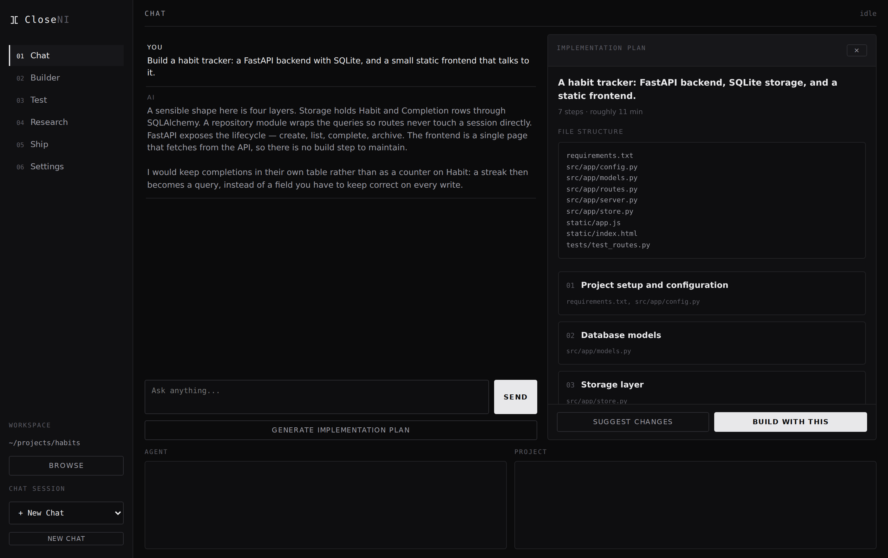

</div>

---

### Providers

CloseNI drives a chat site the way a person does, so each site needs its own page control. Where each one stands, honestly:

| Provider | Status | What is known |
|---|---|---|
| **DeepSeek Chat** | Ready | Driven end to end — plan, build, repair, verify. |
| **Qwen Studio** | Coming soon | Page control works: input found, long prompts pasted via the clipboard, send and completion detection both confirmed against the live site. Gated because a build-sized prompt (~9k characters) outruns the 120s completion wait while the model is still thinking, so the step returns no changes and blocks everything behind it. |
| **GLM (Z.ai)** | Coming soon | The live site declines the build prompts, and the model and thinking controls were not found on the page. Selectors have never been confirmed. |
| HuggingChat, Open WebUI | Not implemented | Config stubs only, `enabled: false`, no selectors. |

Gated providers appear in Settings so it is clear they are planned rather than missing, but they cannot be selected — and `getUsableProvider` refuses them in the agent too, so a preference saved before the gate cannot start a session on one.

Each provider is a JSON file in [`local-agent/config/providers/`](local-agent/config/providers/), read at runtime. Fixing a selector is a text edit and a re-run, not a rebuild. Each gated file carries a `_comingSoonReason` explaining what is left; a test enforces that the reason is there.

**Qwen is the closest.** The next thing to try is raising `completionRules.maxWaitMs` past the point where a reasoning model finishes a full build step, then running a real multi-step build. That is untested, which is why it is gated rather than described as working.

---

### Pipeline Workflow

<div align="center">


</div>

```
   YOU                CloseNI                  CHAT SITE               YOUR DISK
    │                    │                          │                      │
    │  "build me a       │                          │                      │
    │   flask todo api"  │                          │                      │
    ├───────────────────►│                          │                      │
    │                    │   plan this, as JSON     │                      │
    │                    ├─────────────────────────►│                      │
    │                    │◄─────────────────────────┤                      │
    │   ┌─────────────┐  │   6 steps, a run command │                      │
    │◄──┤ review plan │  │                          │                      │
    │   └─────────────┘  │                          │                      │
    │      approve       │                          │                      │
    ├───────────────────►│   step 1 …               │                      │
    │                    ├─────────────────────────►│                      │
    │                    │◄─────────────────────────┤                      │
    │                    │   {"files":[…]}          │                      │
    │                    ├──────────────────────────┼─────────────────────►│
    │                    │   apply, syntax check    │       files written  │
    │                    │                          │                      │
    │                    │   step 2, same thread    │                      │
    │                    ├─────────────────────────►│                      │
```

Nothing is written before you approve the plan, and every step reports what it touched before the next one begins.

---

### The Interface

Six panels, numbered in the order you normally move through them.

#### 01 · Chat — describe it, then read the plan

The prompt goes in, a structured plan comes back: numbered steps, the files each one owns, the dependencies between them, and the command that will eventually run the project. Nothing has been written to disk yet. You can send the plan back for revision as many times as you like.

#### 02 · Builder — watch it happen, step by step

<div align="center">

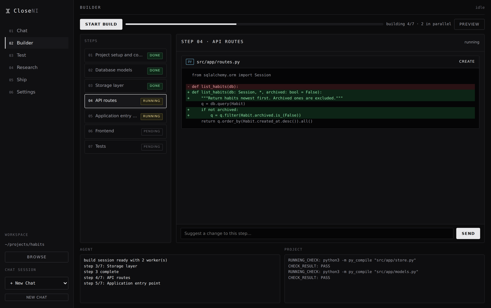

</div>

The step list on the left carries live status. The pane on the right shows the exact diff the model produced for the step currently running — additions in green, removals in red, with the target path and whether the file is being created or edited. The **Suggest a change to this step** box lets you steer a single step without restarting the build.

Two logs run beneath. **Agent** is CloseNI's own narration (`step 4/7: API routes`). **Project** is raw toolchain output (`RUNNING_CHECK: python3 -m py_compile "src/app/store.py"` → `CHECK_RESULT: PASS`). They are kept separate because one is a story and the other is evidence.

The header carries progress (`building 4/7`) and a **Preview** button that opens a live frontend preview when the project serves one.

#### 03 · Test — run it, and ask about it

<div align="center">

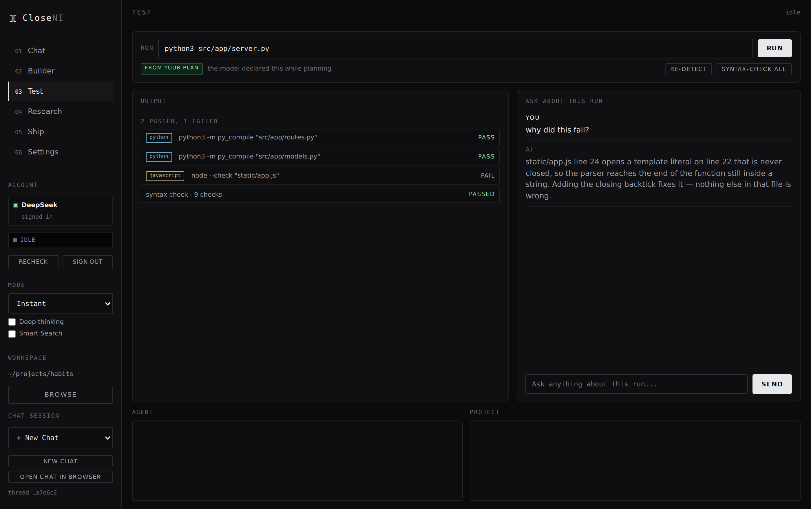

</div>

The run command is resolved before you arrive, and the badge says where it came from — `SAVED` (from `closeni.run.json`), `FROM YOUR PLAN`, `DETECTED` (guessed from the files in this workspace), or `NOT FOUND`. That distinction matters, because a command the model declared while planning deserves more trust than one inferred from a filename. Edit it and the edit sticks; later builds will not silently overwrite it.

**Syntax-check all** sweeps the whole workspace and reports per file with a language tag.

**Run tests** answers the question syntax checks cannot: does the project actually work. It runs the project's own suite and then starts its entry point.

| | |
|---|---|
| **Suites** | Detected, never invented — npm (only when a test script is declared), cargo, go, maven, gradle, pytest, rspec, phpunit, or a bare `tests/` directory. One suite runs, not every suite a polyglot repo could plausibly have. |
| **Smoke run** | Starts the entry point. A server still up when the window closes has passed; a script is judged by its exit code. Opposite success conditions, so they are judged apart. |
| **Missing runner** | A suite whose runner is not installed is reported as **not run** — never as a pass. A green "0 failed" on a project whose tests never executed is the most misleading number this could produce. |

This is what catches a module that compiles perfectly and returns the wrong answer. When something fails, the chat on the right already has the run in context, so *why did this fail?* gets an answer about your actual output rather than a general explanation of the error class.

#### 04 · Research — gated

Listed in the sidebar and not selectable. Chat reaches the same provider and the
same conversation, so nothing is lost by waiting for it.

#### 05 · Ship — commit, push, and watch CI

<div align="center">

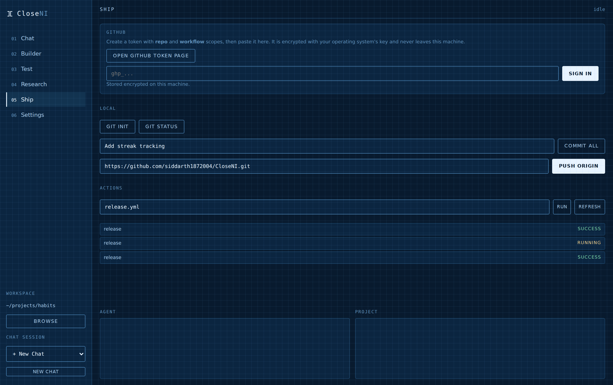

</div>

`git init`, status, commit-all, and push to a remote, plus a live list of GitHub Actions runs with their conclusions and a button to dispatch a workflow. The token box accepts a fine-grained or classic token with `repo` and `workflow` scope; it is encrypted at rest and never written into the repository.

#### 06 · Settings — provider, browser, appearance

<div align="center">

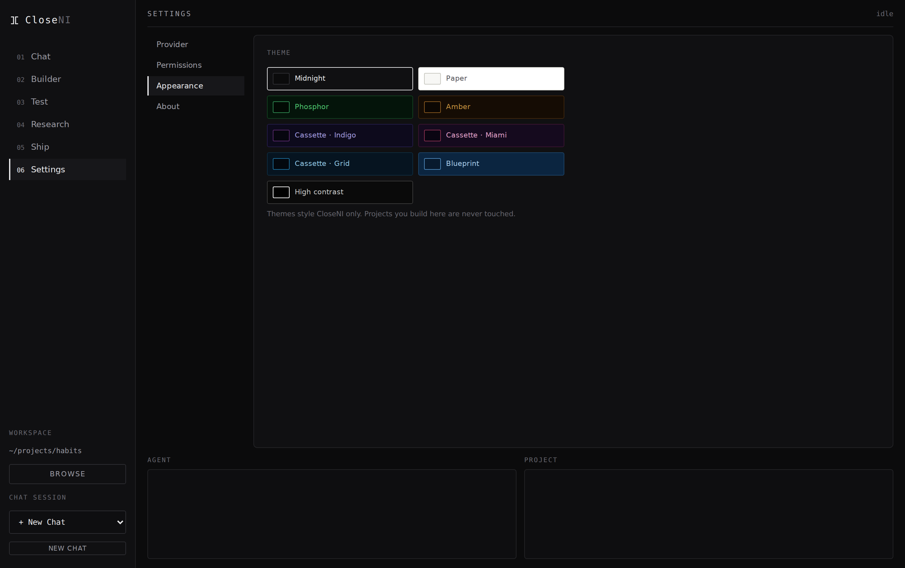

</div>

Four tabs.

**Provider** selects the chat site, reports whether Chromium is installed, and starts the sign-in.

**Permissions** sets autonomy — *ask each command*, *auto-allow*, or *never run commands* — and whether the browser window is visible. There is no parallelism setting: chat, planning and building share one conversation, and a conversation has one composer.

**Appearance** is the theme picker above, with a *texture and glow* toggle for the themes that carry one.

**About** carries version and build information.

The sign-in is a real browser window — you log in the way you always do, and the profile persists so you do not do it again.

---

### Anatomy of a Build

A build is a sequence of round trips, each one narrow enough that the model has a chance of getting it right.

**1 · Plan.** The prompt is wrapped with instructions demanding strict JSON: an array of steps, each with a title, a description, the files it will touch, and a `dependsOn` list. Step count is derived from the described scope, so a single-file script does not get padded to seven steps and a full-stack application is not compressed into them. The plan also carries a `run` command for the finished project.

**2 · Schedule.** The `dependsOn` edges form a directed graph. Steps whose dependencies are all satisfied become runnable simultaneously; the rest wait. Duration is estimated at roughly ninety seconds per step and shown before you commit.

**3 · Execute.** Each step is sent as its own prompt carrying the plan, the step, and the current state of the files it declares. The reply is expected as JSON with a `files` array — path, full contents, and an action.

**4 · Repair the JSON, not just the code.** Web chats wrap answers in prose and fenced blocks, truncate long messages, and occasionally emit trailing commas. The parser strips the wrapper, balances braces, and recovers a usable object from a partial one before it gives up.

**5 · Apply.** Every write is contained to the workspace root — a path escaping it is refused, not sanitised. Existing files are backed up before being overwritten.

**6 · Verify.** The changed files decide which checks run. See the [diagnostics matrix](#language-diagnostics-matrix).

**7 · Resume, do not restart.** Completed steps are recorded. If a build stops halfway — a failure, a closed window, a machine that went to sleep — starting again seeds state from what already succeeded and picks up at the first unfinished step. The log says so plainly: `resuming: 3/7 already done`.

---

### Error Recovery

<div align="center">


</div>

A failing check does not fail the build. The compiler's own stderr — the file, the line, the message — is sent back with the step so the model repairs the specific defect rather than rewriting from memory. Two attempts, then the step is marked failed and the build stops with an explanation instead of grinding forward on broken code.

Environment failures are treated differently from code failures. A `python3 -m venv` that dies because the system Python is externally managed is a problem with the machine, not with the generated source, so it is reported without burning the step's repair budget on code that was never wrong.

---

### Language Diagnostics Matrix

A manifest claims its language. If the workspace has a `Cargo.toml`, Rust files are checked once with `cargo check` rather than one file at a time, because a file that imports its sibling cannot be validated alone. Where no manifest exists, each changed file is checked individually.

<div align="center">


</div>

| Language | Project check (manifest present) | Per-file check |
|---|---|---|
| **Rust** | `Cargo.toml` → `cargo check` | `rustc --emit=metadata` |
| **Go** | `go.mod` → `go build ./...` | `gofmt -e` |
| **TypeScript** | `tsconfig.json` → `tsc --noEmit` | `tsc` |
| **Java** | `pom.xml` → `mvn -q compile`<br>`build.gradle[.kts]` → `gradle compileJava -q` | `javac` |
| **C#** | `*.csproj` → `dotnet build` | — |
| **C** | `Makefile` → `make -n` | `gcc -fsyntax-only` |
| **C++** | `Makefile` → `make -n` | `g++ -fsyntax-only` |
| **Python** | — | `python -m py_compile` |
| **JavaScript** | — | `node --check` |
| **Ruby** | — | `ruby -c` |
| **PHP** | — | `php -l` |
| **Shell** | — | `bash -n` |

`make -n` is a dry run on purpose: it proves the Makefile parses and its targets resolve without dropping object files into your workspace. A check should not build.

A manifest claims its extensions whether or not the tool is installed — so a Rust project on a machine without `cargo` reports a missing toolchain rather than silently falling through to a weaker per-file check.

---

### The Run File

Guessing an entry point from filenames breaks the moment a project lives at `src/app/server.py`. So the answer is written down, in the project, in a file the project keeps.

```jsonc
// closeni.run.json
{
  "version": 1,
  "run": "python3 src/app/server.py",
  "install": "pip install -r requirements.txt",
  "language": "python",
  "userEdited": false,
  "generatedBy": "CloseNI 1.0.0"
}
```

Alongside it, `run.sh` and `run.bat` — so the project starts from a terminal, a file manager, or another machine, with CloseNI nowhere in the picture.

Resolution order is `manifest` → `plan` → `detected` → none, and the panel tells you which one you got. Once `userEdited` is set, later builds leave the command alone; correcting a wrong command and having the next build quietly undo it is how people stop trusting a tool.

Detection, used only as a last resort, understands Node, Python, Go, Rust, Ruby, PHP, .NET, and plain static sites (served with `python3 -m http.server`). A library with no entry point correctly reports that it has none, rather than inventing one.

---

### One Conversation

Chat, planning and building all continue **the same conversation** on the provider's site — the one you can open in your own browser from the sidebar.

```
one profile, one login, one thread
│
├── "build me a flask todo api"        ← chat
├── the plan, as JSON                  ← planning, in the same thread
├── step 1 …  step 2 …  step 3 …       ← the build, still the same thread
└── "why did this fail?"               ← Test and Suggest, same thread again
```

This is the difference between a step prompt being an instruction and a step prompt being an essay. A build used to run in a thread of its own, so every step had to carry the plan, the file tree and the ~3100-character reply-format specification to a model that had never seen any of it. Step 1 of a fifteen-step build reached **9853 characters** and spent its whole completion wait being read rather than answered — and each failed step blocked every step behind it.

In the shared conversation the model already has the plan. The format specification is stated once and referred back to, which alone is **2801 characters saved on every step after the first**.

**The trade-off, stated plainly.** A conversation has one composer, so steps run one at a time. Parallel steps needed a thread each, which is exactly what forced the oversized prompts. A serial step in a thread that already has the context is smaller, faster to answer and far likelier to come back parseable than a parallel one starting from nothing — speed was never the part that was failing.

Earlier versions ran up to three steps in parallel across separate tabs. That work is recorded, with the reasoning for reversing it, in [docs/ROADMAP.md](docs/ROADMAP.md#4--concurrency--multi-agent--built-then-deliberately-reversed). The dependency graph, the scheduler and the serialised-apply lock are all still in place and still correct.

**New Chat** is how you start over: it clears the saved thread, and the next chat, plan or build opens a fresh one.

---

### Safety Model

An agent that writes files and runs commands on your machine has to be explicit about what it will not do.

**Commands always require confirmation**, no matter what the model says about them:

`sudo` · `su` · `apt` / `dnf` / `yum` / `pacman` / `apk` / `brew` · `rm -rf` · `dd if=` · `mkfs` · `chmod 777` · `chown` · `shutdown` / `reboot` / `halt` / `poweroff` · `curl … | sh` and `wget … | sh` (including via `python`, `node`, `perl`, `ruby`) · redirection into `/dev/sd*`, `/dev/nvme*`, `/dev/disk*` · `git push --force` without `--with-lease`

The test is applied to the whole command string, not the first clause, because a real reply once hid `sudo apt install` behind `apt install … || sudo apt install …`.

**Environment setup is recognised, not auto-run** — `venv`, `virtualenv`, `pip install`, `poetry install` are classified so a failure there is reported as an environment problem instead of being mistaken for broken code.

**File writes are contained.** A path that escapes the workspace root is refused. Overwrites are backed up first.

**Git never goes through a shell.** Arguments are passed as an array with `shell: false`, so a commit message of `test; echo INJECTED` becomes a commit subject containing that text and executes nothing. Non-string arguments are rejected outright rather than coerced.

**Tokens stay sealed.** The GitHub token is encrypted with the OS keystore (Keychain, DPAPI, or libsecret), handed to git through `GIT_ASKPASS`, and redacted from every log line by exact-string replacement rather than a regex that a novel token format could slip past. It never reaches `.git/config`, a process argument list, a plaintext file, the renderer, or the agent process.

**Session data is never committed.** Browser profiles, cookies, and chat URLs live under `local-agent/storage/` and are excluded from both version control and the packaged application. The installer's file list is an explicit allow-list, not a glob.

---

### Version Control and Shipping

The Ship panel wraps the parts of git you need at the end of a build:

| Action | What it does |
|---|---|
| `git init` | Initialises a repository in the workspace |
| `git status` | Reports the working tree without leaving the app |
| Commit all | Stages everything and commits with your message |
| Push origin | Pushes to an HTTPS remote, authenticating from the sealed token |
| Clone | Pulls an existing repository into a new workspace |
| Actions | Lists recent workflow runs with conclusions, and dispatches one by filename |

Remote URLs are parsed with an exact host match, so a lookalike domain is not accepted as GitHub.

---

### Visual Themes

Nine themes, switchable from Settings. Themes style CloseNI's own chrome; a project built with CloseNI is never touched, because its appearance belongs to the project rather than to a preference about this application.

<div align="center">


</div>

| Theme | Character |
|---|---|
| **Midnight** | The default. Near-black, low chroma. |
| **Paper** | Full light mode, not a dark theme with the lights turned up. |
| **Phosphor** | Green CRT, with scanlines. |
| **Amber** | Amber CRT, with scanlines. |
| **Cassette · Indigo** | Retro-futurist indigo and magenta. |
| **Cassette · Miami** | Sunset gradient, high saturation. |
| **Cassette · Grid** | Flat retro, no texture. |
| **Blueprint** | Drafting blue on a grid. |
| **High contrast** | Maximum legibility, no decoration. |

<table>
<tr>
<td width="33%">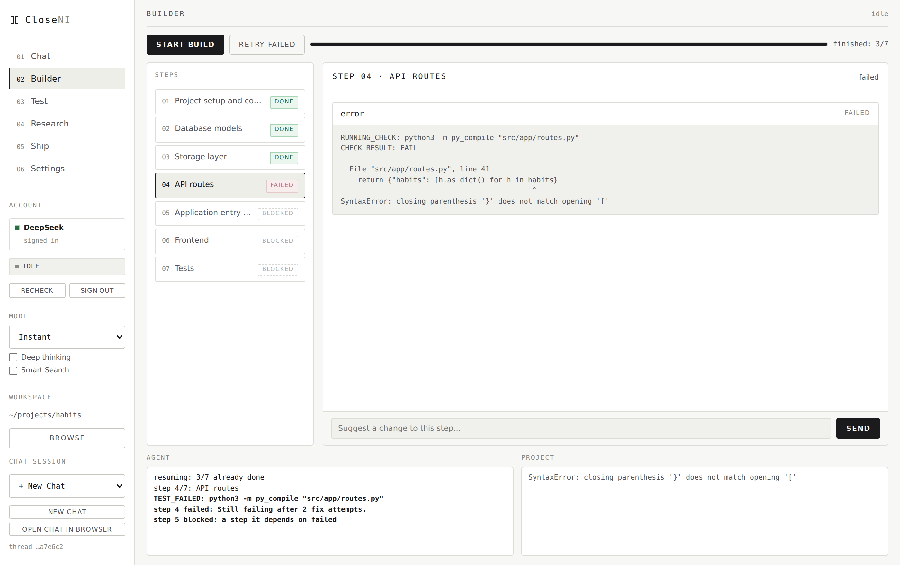<br><div align="center"><sub><b>Paper</b></sub></div></td>
<td width="33%">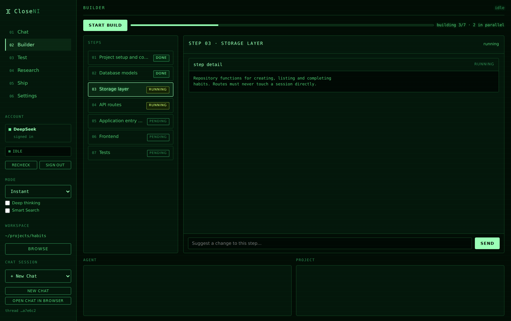<br><div align="center"><sub><b>Phosphor</b></sub></div></td>
<td width="33%">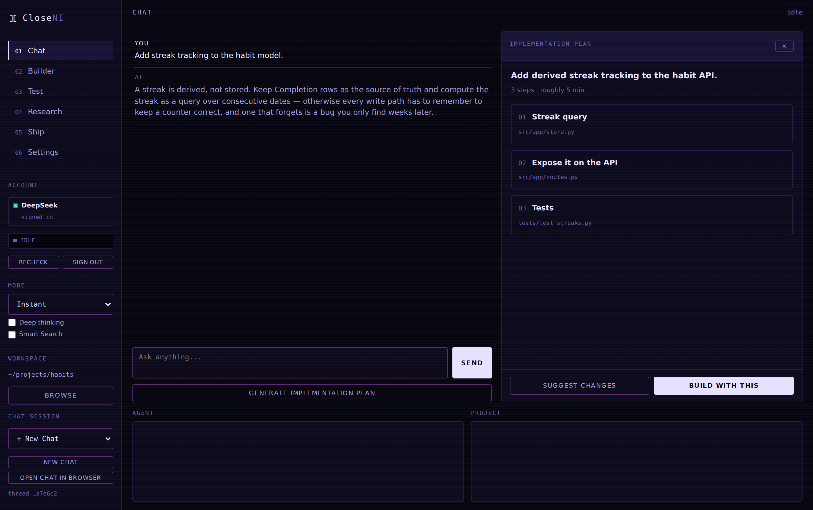<br><div align="center"><sub><b>Cassette</b></sub></div></td>
</tr>
</table>

Themes carrying a texture — scanlines, Blueprint's grid — expose a decoration toggle for anyone who wants the palette without the effect.

Two lints keep this honest, as tests rather than conventions. The first rejects any colour literal outside a theme block, because one hardcoded hex keeps its dark value under every theme and does so silently. The second requires every theme to redefine the whole palette — a theme that omits `--err-bg` inherits Midnight's near-black, which looks fine right up until the day a build fails and Paper renders dark red on black.

Pixel-art motion appears throughout: step spinners, progress ticks, status transitions, and confirmation states, all driven by `steps()` timing so the animation lands on discrete frames rather than blurring between them.

---

### System Architecture

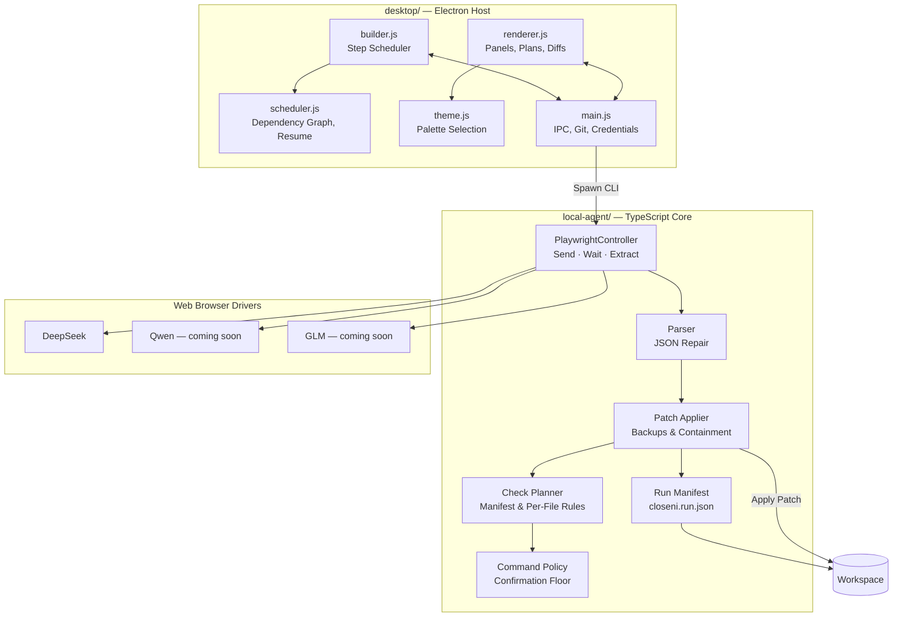

There is no bundler. Renderer modules are written UMD-style — attaching to `window` in the browser and exporting under Node — so scheduling, theming, diffing, and entry-point detection are all unit-testable without a build step or a headless Electron instance.

The TypeScript core compiles to CommonJS in `local-agent/dist/`, and tests run against the compiled output rather than the source, so what is tested is what ships.

---

### Getting Started

#### From source

```bash
# Clone and install dependencies
git clone https://github.com/siddarth1872004/CloseNI.git
cd CloseNI
npm install
npm run build

# Download required Chromium binary
npx playwright install chromium

# Launch application host
cd desktop && npm start
```

**Requirements:** Node.js 18 or newer, and around 650 MB of disk for the Playwright Chromium download. Windows 10+, or a Linux desktop with a keyring available for encrypted token storage.

#### Windows installer

Prebuilt installers are published on the [Releases](https://github.com/siddarth1872004/CloseNI/releases) page.

1. Download `CloseNI-Setup-<version>.exe`.
2. Windows SmartScreen will warn about an unrecognised publisher — the build is unsigned. Choose **More info** then **Run anyway**, or verify the checksum published with the release first.
3. The installer is not one-click; you can choose the install directory.
4. On first launch, open **Settings** and let CloseNI download Chromium.

Linux builds ship as `.AppImage` and `.deb` from the same page.

#### First run

1. **Workspace** — Select a target directory for your project.
2. **Settings** — Select an AI provider, install Chromium if prompted, and sign in. The browser window that opens is real; log in as you normally would. The profile persists, so this happens once per provider.
3. **Chat** — Describe what you want. Review the returned plan and revise it until it looks right.
4. **Build** — Approve, then watch the steps land. Diffs, logs, and checks are all visible as they happen.
5. **Test** — Run the project from the resolved command and ask the model about anything that failed.
6. **Ship** — Commit and push when you are happy with it.

#### WSL Integration

```bash
source scripts/wsl-env.sh
```

Sets up the display and library paths needed for Electron and Chromium under WSL2.

---

### Test Suites

```bash
npm test              # unit suite — 536 tests, no browser required
npm run test:e2e      # end-to-end, real Chromium against a local mock provider
npm run verify        # 41 structural checks: claims vs code, release config, packaging
npm run verify:visual # all nine themes rendered and contrast-checked, plus the site
```

The end-to-end suite drives a real Chromium against a local HTTP server that imitates a chat site. Only the model's answers are faked; the page interaction, streaming detection, extraction, parsing, patch application, and verification are all the production paths. It is the suite that finds the defects reading cannot: blank worker pages and a session reporting itself ready before its output handler was attached, back when steps ran in parallel; and, when chat, plan and build were merged into one conversation, the two assertions that were still checking for the old separate build thread.

#### What the verification scripts cover

[`scripts/verify.mjs`](scripts/verify.mjs) checks the things that rot silently: that the documentation still matches the code (language count, theme count, repair budget), that every referenced image and anchor resolves, that the SVGs carry no `<script>` and no external reference, that the release workflow still gates on tests and checks the tag against `package.json`, and that the packaged artifact contains what it must and nothing from `local-agent/storage/`.

[`scripts/verify-visual.mjs`](scripts/verify-visual.mjs) renders the application in a real browser under **each of the nine themes** and measures the contrast of every element that carries meaning — status words, diff lines, muted labels, buttons — against its actual background. The CSS lint in the unit suite proves a theme *declares* the whole palette; it cannot prove the declared colours are legible together. This is what caught Midnight, the default theme, sitting at 2.9:1 on its micro labels — the lowest of all nine.

Both are run with `npm run verify` and `npm run verify:visual`. Each prints, at the end, what it does **not** cover.

---

### Distribution Builds

Releases are driven by a tag. `npm version 1.0.1 -m "Release %s"` then `git push --tags` builds on `windows-latest` and `ubuntu-latest` and attaches the installers to a draft release. The full process, including how to verify an artifact before publishing, is in [docs/RELEASING.md](docs/RELEASING.md).

| Platform | Artifact |
|---|---|
| Windows | `CloseNI-Setup-<version>.exe` (NSIS, chooses its own install directory) |
| Linux | `CloseNI-<version>.AppImage` |
| Linux | `closeni_<version>_amd64.deb` |

Locally:

```bash
# Unpacked distribution directory
npm run pack

# Target platform installer (.exe / .deb / AppImage)
npm run dist
```

The packaged `files` list is an explicit allow-list. Widening it to a glob would sweep `local-agent/storage/` — live session cookies and private chat URLs — into a shipped artifact. The 1.0.0 Linux artifacts were audited for exactly that and contain nothing from `storage/`.

---

### Directory Tree

```
desktop/          Electron UI host, IPC handlers, and renderer
  main.js           Process host: IPC, git, credentials, agent lifecycle
  renderer.js       Panels, plan review, diff rendering
  builder.js        Step orchestration
  scheduler.js      Dependency graph, runnable set, resume state
  theme.js          Theme registry and persistence
  github-safe.js    Token redaction, argument validation, URL parsing
  entrypoint.js     Entry-point detection across languages

local-agent/      Playwright drivers, DOM parsers, and patch application engine
  src/providers/    Per-provider page control
  src/verification/ Check planning and command policy
  src/run-manifest  closeni.run.json read, write, and merge
  test/             Unit and end-to-end harnesses

vscode-extension/ A 97-line VS Code prototype: one command that runs the agent
                  against the open workspace. It compiles and is kept, but it
                  predates the desktop app, is not part of any roadmap item, and
                  has never been exercised by the test suites. The desktop app
                  is the supported interface.

shared/           Shared type definitions and schemas
build/            Brand assets and icons
docs/             Architecture specifications, plans, screenshots, and the site
scripts/          Environment configuration, screenshot and asset generation
```

---

<div align="center">


</div>

### Current Limitations

Stated plainly, because a README that only lists strengths is not useful.

* **One provider is ready.** DeepSeek is driven end to end. Qwen Studio and GLM ship gated as coming soon — they appear in Settings but cannot be selected, and the agent refuses them if asked anyway. See [Providers](#providers) for exactly where each one stands.
* **Chat sites change.** Provider control is per-site page automation. A redesign can break extraction until the selectors are updated — which is a JSON edit, not a code change.
* **Verification is syntax and compilation, not correctness.** A project can pass every check and still be wrong. `make -n` and `--noEmit` prove things parse and resolve; they do not prove behaviour.
* **Installers are unsigned.** SmartScreen and Gatekeeper will say so, and that warning is accurate.
* **Only the Linux artifacts have been verified.** The AppImage and `.deb` were built, audited for leaked session data, and launched with the renderer confirmed loading. There is no Windows machine in the development environment, so the first `.exe` the release workflow produces is unverified until someone installs it.
* **Large projects are not yet proven at scale.** Builds in the range of a few dozen steps behave well. Beyond that is untested.
* **Terms of service are your responsibility.** Automating a web interface may conflict with a provider's terms. Check before pointing this at an account you care about.

---

### License

MIT — see [LICENSE](LICENSE). Copyright (c) 2026 Siddarth S.
