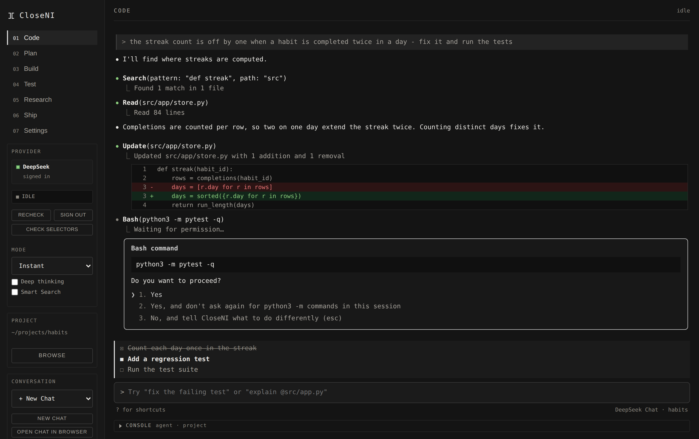
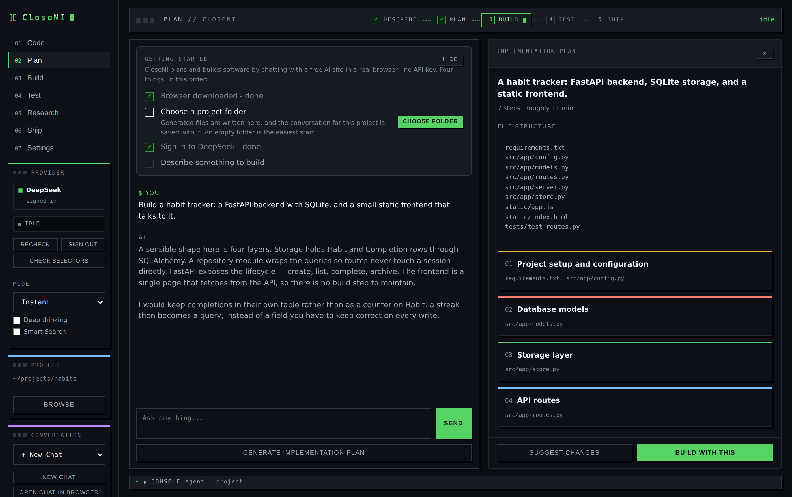
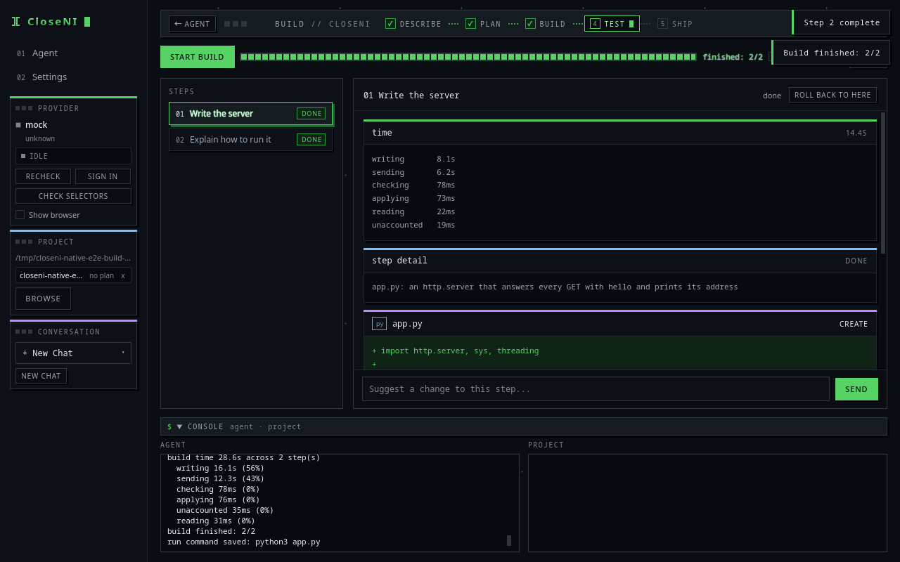
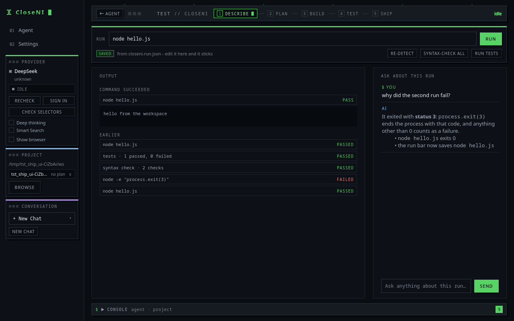
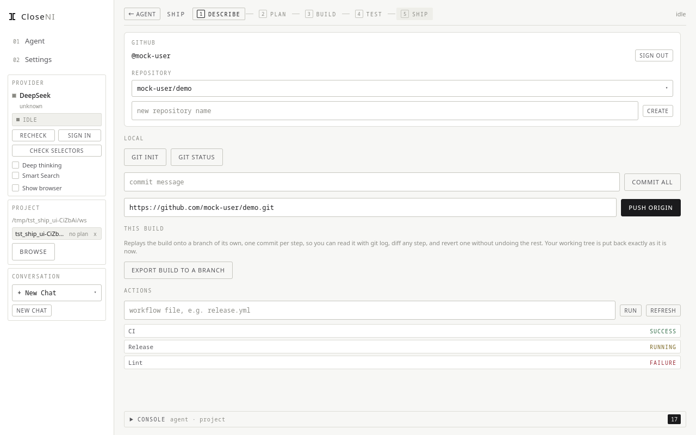
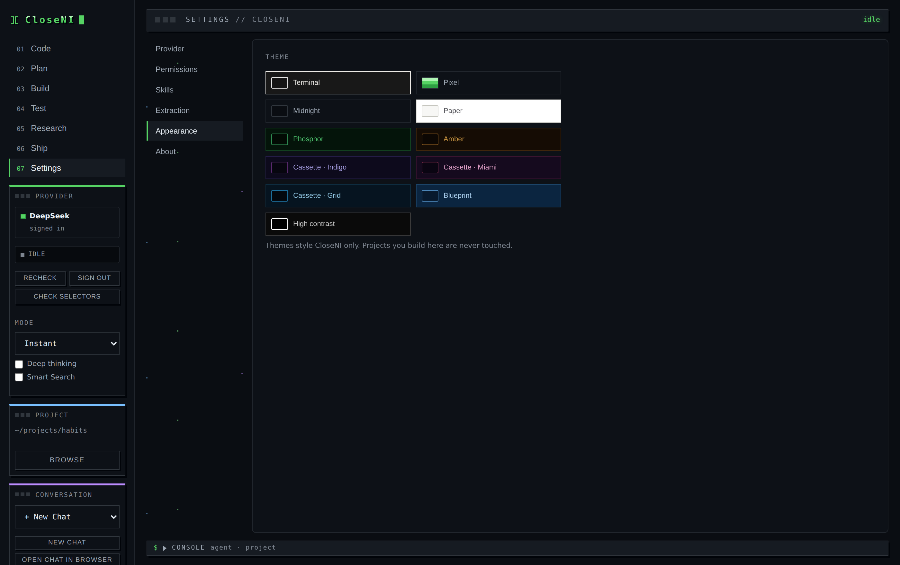
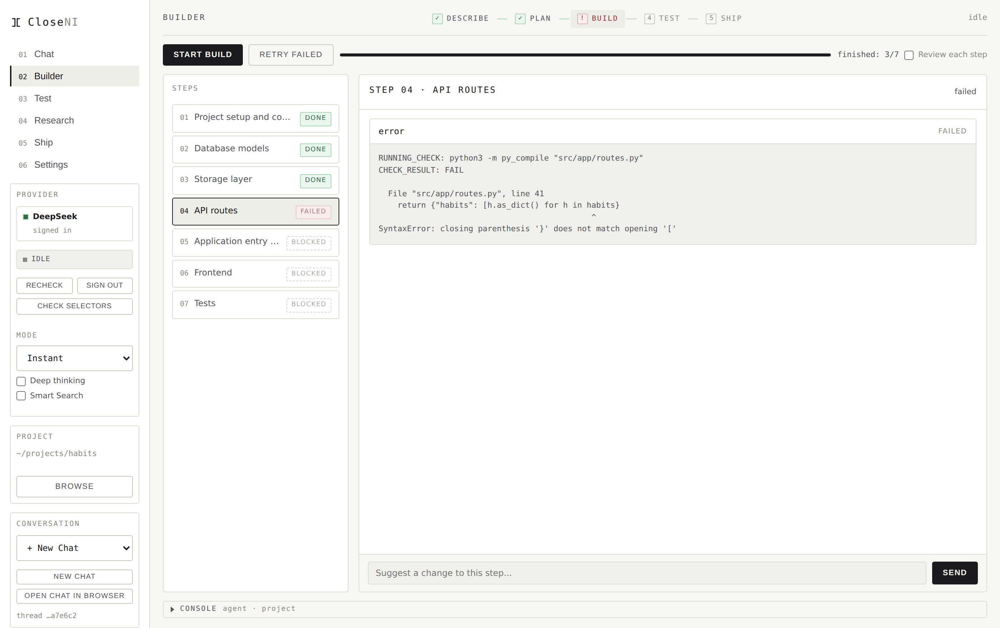
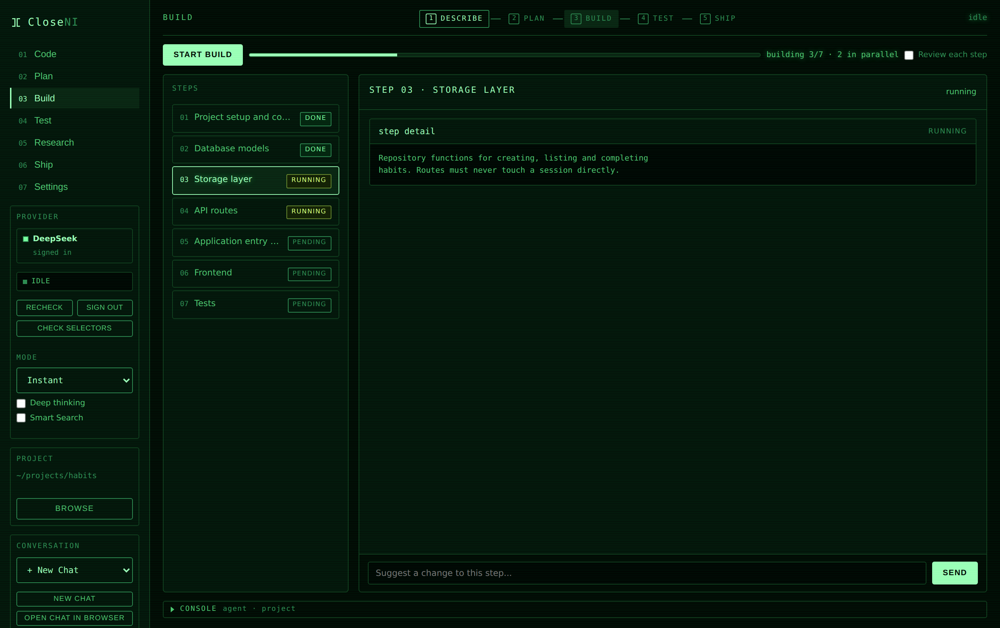
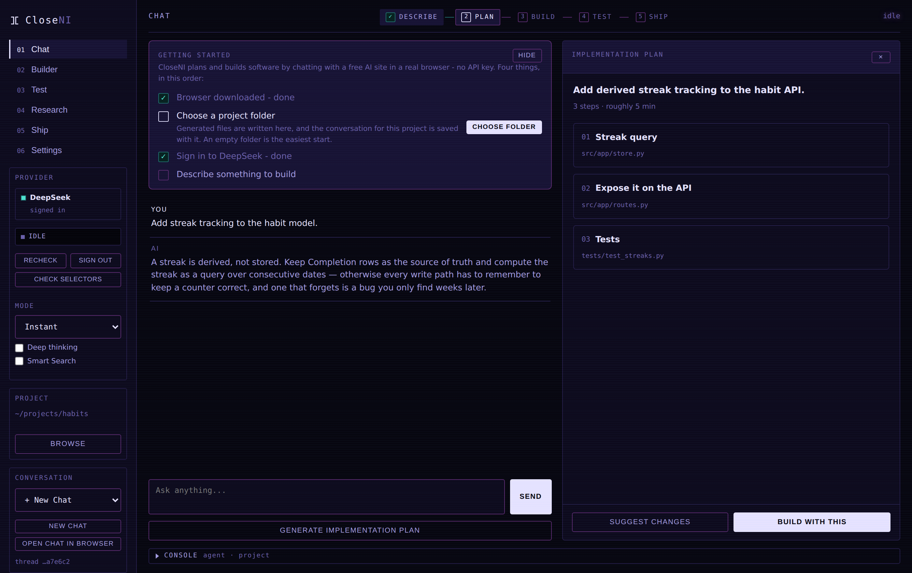

<div align="center">



# CloseNI

**Free web AI chats, turned into a coding agent.**<br>
Ask for a change and it reads your project, edits files, runs commands and checks its work, asking before anything it should. The model is a chat site driven in a real browser, so there is no API key and no per-token bill.

[](https://www.qt.io/)
[](https://www.typescriptlang.org/)
[](https://playwright.dev/)
[](#what-it-is)
[](LICENSE)

[**Download**](https://github.com/siddarth1872004/CloseNI/releases/latest) · [**Site**](https://siddarth1872004.github.io/CloseNI/) · [**Get started**](#get-started) · [**Limitations**](#limitations) · [**Changelog**](CHANGELOG.md)

</div>

---

## What it is

CloseNI opens a real Chromium window with the chat site you are already signed into. It types the prompt, waits for the reply to finish streaming and reads it back. From the site's side it is a person typing. From yours it is a coding agent working in your project folder.

The app itself is native: Qt Quick on Windows, macOS and Linux, with no web view anywhere. The agent beside it is a Node and Playwright process.

> **Where it stands.**
> - **DeepSeek** is driven end to end, including long sessions.
> - **Qwen Studio** and **GLM** can be selected, as **experimental**.
> - **Ollama** is local and **chat-only**.
> - Installers are **unsigned**, so SmartScreen and Gatekeeper warn on first launch.

## The coding agent



Ask in plain words: "fix the failing test", "add pagination to the list endpoint", "explain @src/app.py". A chat site has no tool-calling API, so the tools are a convention: the model answers with fenced blocks that name a tool, CloseNI runs them and sends the results back as the next message.

| Tool | Does | Asks first? |
|---|---|---|
| `read`, `glob`, `grep`, `ls` | read and search the project | only for secret files such as `.env` or a private key |
| `edit`, `write` | change or create a file, shown as a diff | in default mode |
| `bash` | run a command in the project folder | unless you said "don't ask again" for it |
| `todo` | the agent's own task list | never |

**Modes**, cycled with shift+tab: **Default** asks before edits and commands, **Accept edits** asks only before commands, **Plan** is read-only until you approve its plan, and **Auto** runs everything. `sudo`, package managers, recursive deletes and the rest of the [safety list](#safety) ask in every mode.

Also: `@path` attaches a file, `/rewind` undoes the last turn's file changes, `/init` writes a `CLOSENI.md` of project instructions, and Esc stops the agent after the current reply. From a terminal: `npm run agent -- "fix the failing test" ./project deepseek`.

## Planned builds

For a whole project there is the planned build (`/build`, or the Plan and Build panels). It plans the project as steps, you revise the plan, and nothing is written until you approve it.

<div align="center">

</div>

Each step is built in the same conversation, written inside the workspace with a backup first, and then checked with the project's real compiler. A failing check sends the compiler's own error back to the model. **Two attempts**, then the step is marked failed and the build stops and explains. A build that stopped halfway resumes at the first unfinished step. The finished project gets a `closeni.run.json`, `run.sh` and `run.bat`, so it runs without CloseNI.

**Twelve languages** are checked against their real toolchains:

| Language | With a manifest | Per file |
|---|---|---|
| Rust | `cargo check` | `rustc --emit=metadata` |
| Go | `go build ./...` | `gofmt -e` |
| TypeScript | `tsc --noEmit` | `tsc` |
| Java | `mvn -q compile` or `gradle compileJava -q` | `javac` |
| C# | `dotnet build` | — |
| C, C++ | `make -n` | `gcc` / `g++ -fsyntax-only` |
| Python, JavaScript, Ruby, PHP, Shell | — | `py_compile`, `node --check`, `ruby -c`, `php -l`, `bash -n` |

The checker also knows 16 more languages (Kotlin, Scala, Swift, Dart, Zig, Elixir and others), which have not been run against their real toolchains yet.

## Conversations

Chat, planning and building continue **one conversation** on the provider's site, so a step prompt can be a short instruction instead of re-explaining the project. The cost is that steps run one at a time; the [roadmap](docs/ROADMAP.md) records why.

The rail lists every chat in the project, newest first, named after its first message. Open one to get its messages and plan back, rename it, or remove it from the list. **New Chat** starts a fresh one. Messages are saved on disk and come back after a restart. Nothing switches while a reply, a build or a Code turn is using the thread.

## Providers

| Provider | Status |
|---|---|
| **DeepSeek Chat** |  Chat, plan, build and the coding agent. Busy, rate-limited, cut and full replies are recognised and handled. |
| **Qwen Studio** |  Page control works; build-sized prompts not re-checked live. |
| **GLM (Z.ai)** |  The least proven; its selectors have never been confirmed. |
| **Ollama (local)** |  Local HTTP, no login. Chat only; plan and build need a browser provider. |

Each provider is a JSON file in [`local-agent/config/providers/`](local-agent/config/providers/), read at runtime, so fixing a selector is a text edit, not a rebuild.

## Research

The **Research panel** asks the provider with its own web search turned on (DeepSeek's Smart Search) and lists the sources it cited. Alongside, it searches GitHub repositories with your signed-in token. Any result can be cloned or used as a reference for the next plan. It runs in a conversation of its own.

## The app

| | |
|---|---|
|  |  |
| **Chat and Plan.** Describe it, then read and revise the plan. | **Build.** Live step status and the diff for each step. |
|  |  |
| **Test.** Run the project and its own tests. A missing runner is reported as not run, never as a pass. | **Ship.** Commit, push and watch GitHub Actions. |

**Settings** covers the provider and sign-in, autonomy, skills and personas, and appearance. Sign-in happens in a real browser window, and the profile persists.



## Eleven themes

<div align="center">

</div>

| | | |
|---|---|---|
|  |  |  |
| **Paper** | **Phosphor** | **Cassette** |

Themes style CloseNI itself and never touch a project built with it.

## Architecture

<div align="center">

</div>

- **`native/`** is the app: QML for the window, C++ services for the agent and run processes, git, GitHub, files and the keyring. Pure logic (scheduling, themes, diffs, entry points) is plain ES modules in `native/qml/js/`, loaded by QML and unit-tested by Node. See [native/ARCHITECTURE.md](native/ARCHITECTURE.md).
- **`local-agent/`** is the TypeScript core: page control per provider, reply parsing, contained file writes, check planning and the command policy.
- **`local-agent/src/web/`** is a newer browser layer with research and cited sources. It passes against fixture pages and is not yet used by builds.

## Safety

- **Commands that can do damage always ask**: `sudo`, package managers, recursive deletes in any spelling, `curl … | sh`, `git push --force`, `git reset --hard` and more. "Don't ask again" is never offered for them.
- **Writes stay in the workspace.** A path that escapes it is refused, symlinks included, nothing inside `.git` is written, and overwrites are backed up.
- **Secret files ask first** in every mode, because whatever the agent reads is typed into a chat site.
- **Git never goes through a shell**, and the GitHub token is kept in the OS keyring and redacted from every log.

The command list reads the command's text, so it is a floor, not a sandbox: a script the model writes and then runs gets past it. [docs/SAFETY.md](docs/SAFETY.md) lists what holds and what doesn't.

## Get started

**Download** the installer for your system from the [latest release](https://github.com/siddarth1872004/CloseNI/releases/latest):

| System | File |
|---|---|
| Windows 10+ x64 | `CloseNI-Setup-<version>.exe` |
| macOS (Apple silicon, Intel) | `CloseNI-<version>-arm64.dmg`, `CloseNI-<version>-x64.dmg` |
| Linux x64 | `CloseNI-<version>.AppImage`, `closeni_<version>_amd64.deb` |

They bundle Qt, Node and the agent. Chromium (about 650 MB) is downloaded on first run. They are unsigned: on macOS, allow the app under System Settings → Privacy & Security the first time it is blocked.

**From source** (Node 22.12+, Qt 6.8+, CMake 3.21+ and Ninja):

```bash
git clone https://github.com/siddarth1872004/CloseNI.git && cd CloseNI
npm install && npm run build
npx playwright install chromium
cmake -S native -B build-native -G Ninja && cmake --build build-native
npm start
```

**First run.** Pick a project folder, choose a provider, install Chromium and sign in once in the browser window. A checklist above the chat walks through it.

The GitHub token is kept in the OS keyring: DPAPI on Windows, the keychain on macOS, the Secret Service on Linux. Without a keyring CloseNI still runs, but asks you to sign in to GitHub each launch.

## Development

```bash
npm test                        # unit suite, no browser
npm run test:e2e                # real Chromium against a mock chat site
npm run test:web                # the browser layer against provider-shaped fixtures
ctest --test-dir build-native   # the native app's C++ and QML tests
npm run verify                  # the docs, assets and packaging still match the code
npm run dist                    # stage the app and build this system's installers
```

Releases are built by CI from a version tag; see [docs/RELEASING.md](docs/RELEASING.md). Report bugs with the [issue form](https://github.com/siddarth1872004/CloseNI/issues/new/choose), including the last lines of the Console drawer.

## Limitations

- **One provider is proven.** Qwen Studio and GLM are experimental, and chat sites change: a redesign can break page control until the selectors are updated.
- **Checks prove it compiles, not that it is right.** A project can pass every check and still be wrong.
- **Large projects are untested.** Builds of a few dozen steps behave well; beyond that is unknown.
- **The installers are unsigned**, and the browser layer in `local-agent/src/web/` has not yet run against the live sites. See the [roadmap](docs/ROADMAP.md).
- **Terms of service are your responsibility.** Automating a web interface may conflict with a provider's terms.

## License

MIT. See [LICENSE](LICENSE). Packaged builds bundle Qt (LGPL-3.0), Node.js and Playwright, each under its own licence. Chromium is downloaded at first run, not bundled.
