# Browser-native AI and research layer

`local-agent/src/web/` treats DeepSeek, Qwen and GLM as **web applications driven through a
browser**, not as APIs. It also holds a research engine that searches, reads and cites the web
through the same browser. It was built beside `PlaywrightController`, not over it. The audit that
explains why is at [`docs/audit/2026-09-26-browser-layer-audit.md`](../audit/2026-09-26-browser-layer-audit.md).

Hard rules the code keeps:

- No API clients, no API keys.
- No account creation, no signing in, no attempt to get past a login, a CAPTCHA or a rate limit.
  Detection exists so a run can **stop and say why**.
- Passwords, cookies, tokens and credentials are never logged. `trace.ts` redacts URLs and text
  before anything is written.
- Authenticated content is never cached. `TtlCache.set` refuses entries marked `authenticated`.
  Only the isolated, logged-out research context feeds the caches.
- A behaviour that has not been observed on the live site is marked `UNVERIFIED` or `UNKNOWN`,
  never assumed.

```
src/web/
  trace.ts, util.ts             structured events with redaction; shared helpers
  browser/                      session manager, navigation, diagnostics
  selectors/chain.ts            fallback chains with diagnosis
  semantic/                     DOM snapshot + tolerant HTML parser → typed blocks
  response/normalize.ts         Raw → DOM → Semantic → Normalized → Structured
  providers/                    AIWebProvider, UI state, completion, adapters
  research/                     planner, search, fetch, page model, evidence, context, agent
  live.ts                       the identical scenarios against the live sites
```

---

## 1 · Browser

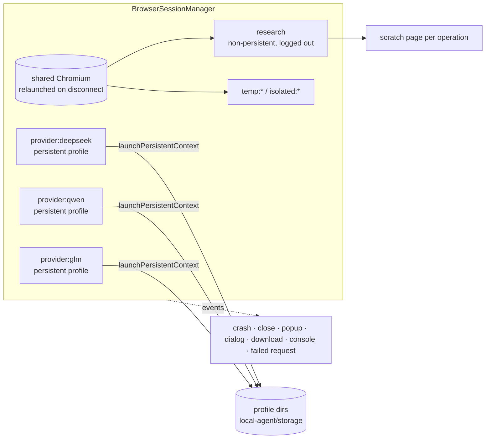

- **Isolation.** Each provider has its own persistent context and profile, so cookies and storage
  never cross. The research context is fresh and logged out. Two contexts on one profile are
  refused, because they would share a login.
- **Concurrency.** Concurrent requests for one context key share a single launch (the `creating`
  map). Each research fetch or search gets its own scratch page, so parallel operations never
  navigate each other's page.
- **Page events.** Popups are judged after a short delay, so pages we opened ourselves are never
  mistaken for them. Dialogs are dismissed, and `beforeunload` is accepted. Downloads are
  cancelled unless allowed. Crashes and closes mark the page unhealthy, so the next action
  re-acquires one.
- **Bounded shutdown.** Closing a context or the browser is capped at 5 s, with a SIGKILL
  fallback. A wedged renderer cannot hang the process on exit.
- **No evasion.** The layer does not pass `--disable-blink-features=AutomationControlled`, unlike
  the old controller. The audit, item 9, covers this.

## 2 · Provider

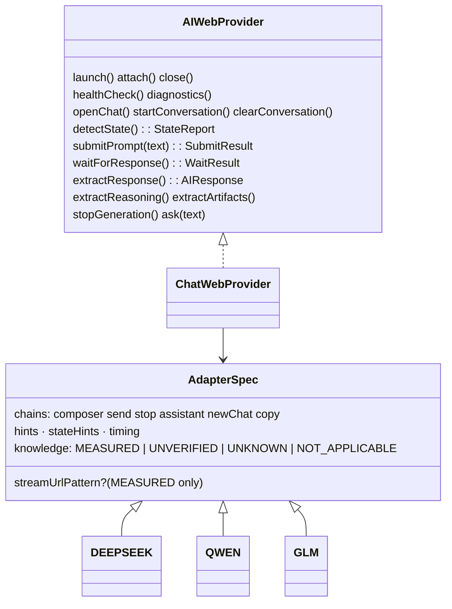

One class drives all three sites. Each adapter is data: selector chains with provenance tags,
state hints, timing, and a `knowledge` map of what is known. Adding a site means adding an
adapter, not a class.

### UI state

```mermaid
stateDiagram-v2
  [*] --> LOADING
  LOADING --> CHAT_READY : composer visible + enabled
  LOADING --> AUTH_REQUIRED : password field / login dialog / 401·403
  LOADING --> CAPTCHA : challenge widget
  LOADING --> ERROR : 5xx / error alert, no composer
  LOADING --> READY : loaded, no composer, no login markers
  CHAT_READY --> GENERATING : sent; stop control / text changing
  GENERATING --> GENERATION_COMPLETE : completion signal
  GENERATING --> GENERATION_FAILED : reply request failed / error alert
  GENERATING --> RATE_LIMITED : 429 / rate-limit alert
  GENERATING --> AUTH_REQUIRED : login demanded on send
  GENERATION_COMPLETE --> CHAT_READY
  note right of AUTH_REQUIRED : terminal for automation.<br/>The run stops and records it.
```

`collectSignalsInPage` reports facts from the page. The pure function `classifyState` decides
what those facts mean, with a fixed precedence: CAPTCHA > login > HTTP auth > rate limit >
server error > error alert > generating > ready. Every rule is unit-tested against signal sets.
`UNKNOWN` is returned when the page does not answer within 8 s.

### Completion, without sleeps

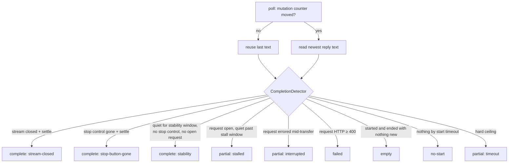

- **Signals, strongest first.** The strongest is the reply request closing. It is measured on
  DeepSeek only (XHR `/api/v0/chat/completion`, tapped by the shared `providers/stream-tap.ts`).
  Next is the stop control disappearing (Qwen), then text stability. A strong signal shortens the
  wait but never skips the settle window.
- **Pauses.** While the stop control is visible, or the reply request is still open, stability
  alone does not end the wait. A model pausing mid-answer is not a finished answer.
- **Streaming capture.** `StreamCapture` reports each change as previous / current / delta. It
  labels re-renders as `rewrite` rather than inventing a delta.
- **Stuck pages.** Every in-wait page call is bounded. A page whose main thread is stuck ends as
  `interrupted` after `unresponsiveMs`, and the page is replaced.

## 3 · Extraction

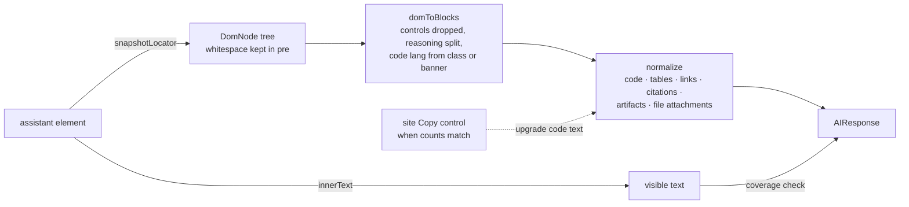

`AIResponse` fields are filled only from what was observed. `conversationId` comes from the URL,
`messageId` from markup, and `reasoning` only when a reasoning block exists. The response is
`empty` when nothing was said. Warnings record lost structure: no DOM means text only, and a
warning is added when the structured text covers under 60% of the visible text.

## 4 · Research

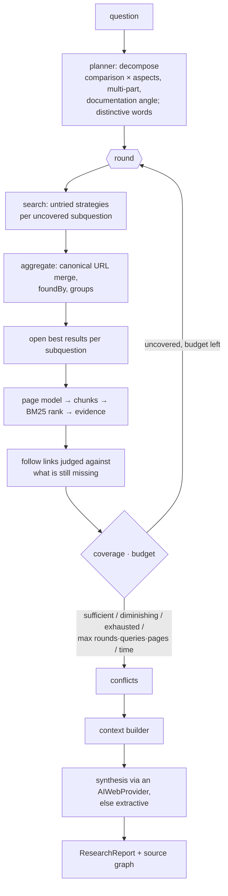

### Search

```mermaid
flowchart LR
  SQ[SearchQuery<br/>text · strategy · subquestion] --> BB[BrowserSearchBackend<br/>engine adapter, scratch page]
  SQ --> GH[GitHubSearchBackend]
  SQ --> AI[AIWebSearchBackend<br/>provider's own search]
  BB & GH & AI --> N[SearchResult<br/>canonical_url · domain · source_type ·<br/>relevance signals · foundBy]
  BB -. challenge page .-> BL[status blocked, never solved]
```

Engine adapters: `FIXTURE_ENGINE` is tested. `DUCKDUCKGO_HTML` and `BING` are `UNVERIFIED`,
because they could not be reached from the development machine.

### Fetch and page model

`WebFetcher` tries plain HTTP first. It escalates to the browser when the page looks like an app
shell. The browser path waits for the text to stop changing and scrolls a bounded number of
times. `buildWebPage` produces sections with heading paths, links (with `inMain` and heading
context), tables, code, lists, images, metadata, `published_at` and a content hash. Three methods
vote on the main content: semantic tags, text density, and headings.

### Evidence

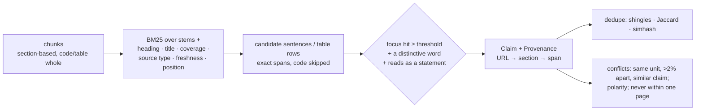

Relevance is a set of named signals. There is no single made-up "quality score".

### Context

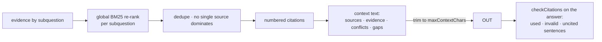

## 5 · Failure recovery

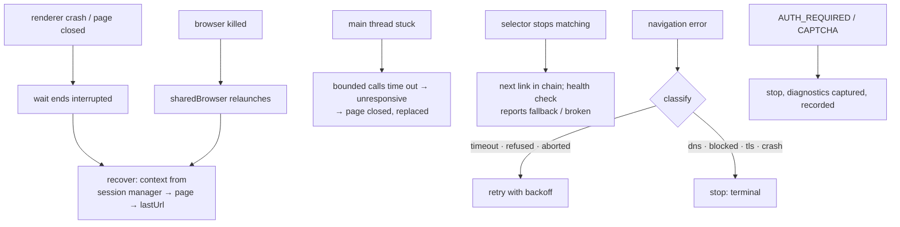

Diagnostics are written to `storage/diagnostics/`: a viewport screenshot, a sanitised DOM (script
bodies, input values and editable text removed, then redacted), an ARIA snapshot, and
`meta.json`. They are captured on every terminal state.

## 6 · Caching

| Namespace | TTL | Holds |
|---|---|---|
| `search` | 30 min | normalised results per backend+query |
| `page` | 6 h | fetched page models, keyed by canonical URL |
| `parsed` | 6 h | parsed DOM |
| `chunks` | 7 d | chunks by content hash |
| `evidence` | 7 d | evidence by content hash + subquestion |
| `meta` | 24 h | robots, redirects |

The caches use LRU eviction (500 entries) and can be mirrored to disk. Provider chat content is
never cached: it is authenticated.

## 7 · Testing harness

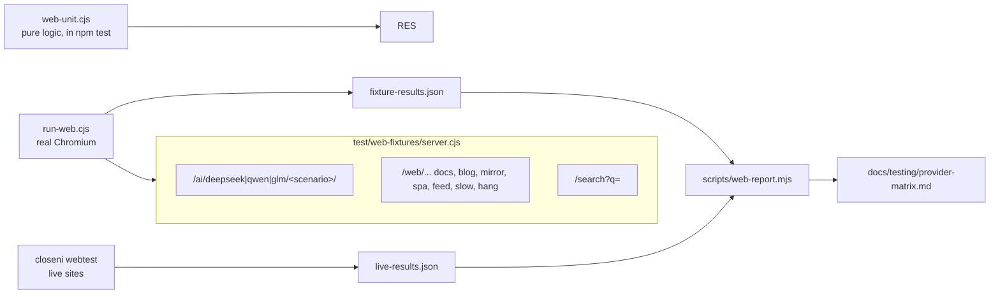

The three provider flavours run **the same scenarios**. Each flavour mirrors that provider's
known structure: DeepSeek uses XHR and has no stop control, Qwen has a stop control, and GLM is
contenteditable with obfuscated classes. The scenarios cover login, CAPTCHA, errors, modal,
popup, dialog, pause, late start, rewrite, stall, cut, layout change, slow stream, a locked main
thread, and an empty bubble.

| Command | Runs |
|---|---|
| `npm test` | whole unit suite, including `web-unit.cjs` |
| `npm run test:browser` | session manager, lifecycle, navigation, chains, diagnostics |
| `npm run test:providers` / `test:deepseek` / `test:qwen` / `test:glm` | identical scenarios per flavour |
| `npm run test:extraction` | normalisation units + recorded DeepSeek markup |
| `npm run test:research` | fetcher, search, loop, dedupe, conflicts, links, budgets |
| `npm run test:chaos` | killed browser, closed tab, removed selector, viewport, reload, malformed DOM |
| `npm run test:web` | all of the above (writes `fixture-results.json`) |
| `npm run test:all` | unit + web + e2e |
| `npm run webtest -- <deepseek\|qwen\|glm\|all> [--headed]` | live sites, results merged into `live-results.json` |
| `npm run web:report` | regenerates the matrix |

In a container where Playwright's pinned Chromium build is missing, point `CLOSENI_CHROMIUM` at a
Chromium binary.
